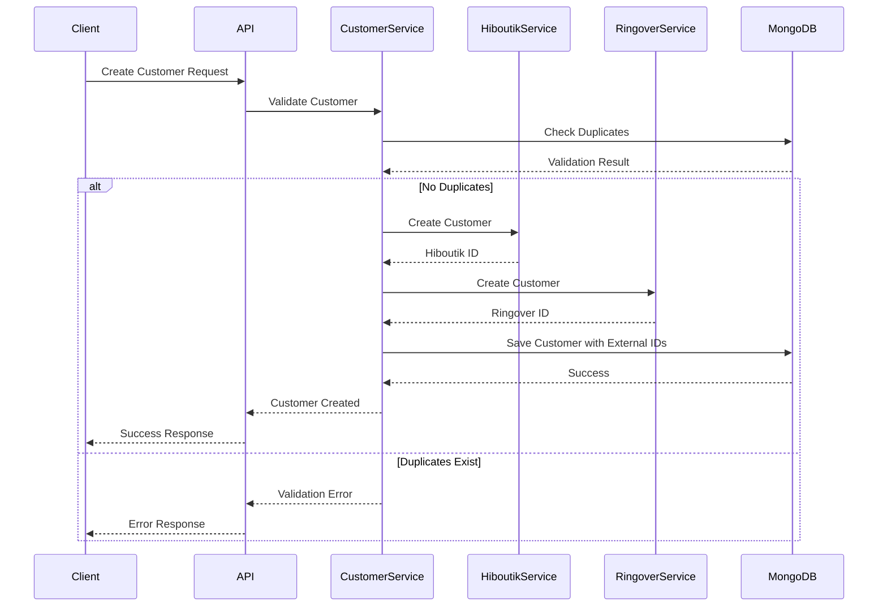

# mExpress MVP Core Architecture Design

## 1. System Overview

### 1.1 Architecture Style
- Modular monolith with service-oriented internal structure
- Designed for future microservices transition
- RESTful APIs for external communication
- Event-driven integration patterns

### 1.2 Core Components
```
mExpress MVP
├── Core Services
│   ├── Auth Service (User Management)
│   ├── Customer Service
│   └── Product Service
├── Integration Services
│   ├── Hiboutik Integration
│   ├── Ringover Integration
│   └── PrintNode Integration
├── API Gateway
└── Shared Infrastructure
    ├── MongoDB
    ├── Redis (Caching)
    └── Message Queue
```

## 2. Technical Stack

### 2.1 Backend
- Node.js with Express.js
- TypeScript for type safety
- MongoDB for data storage
- Redis for caching and session management
- Bull for job queues

### 2.2 Authentication
- JWT-based authentication
- Role-based access control (RBAC)
- Secure password hashing with bcrypt
- Session management with Redis

## 3. Core Services Design

### 3.1 Auth Service
```typescript
interface User {
  id: string;
  email: string;
  password: string; // Hashed
  role: 'admin' | 'user';
  createdAt: Date;
  updatedAt: Date;
}

interface AuthResponse {
  token: string;
  refreshToken: string;
  user: Omit<User, 'password'>;
}
```

### 3.2 Customer Service
```typescript
interface Customer {
  id: string;
  email: string;
  phone: string;
  firstName: string;
  lastName: string;
  externalIds: {
    hiboutik?: string;
    ringover?: string;
  };
  createdAt: Date;
  updatedAt: Date;
}

interface CustomerValidation {
  isEmailUnique: boolean;
  isPhoneUnique: boolean;
}
```

### 3.3 Product Service
```typescript
interface Product {
  id: string;
  name: string;
  description: string;
  sku: string;
  price: number;
  stock: number;
  createdAt: Date;
  updatedAt: Date;
}
```

## 4. Integration Services

### 4.1 Hiboutik Integration
```typescript
interface HiboutikConfig {
  apiKey: string;
  accountId: string;
  baseUrl: string;
}

interface HiboutikCustomer {
  id: string;
  email: string;
  phone: string;
  firstName: string;
  lastName: string;
}

class HiboutikService {
  async createCustomer(customer: Customer): Promise<string>; // Returns Hiboutik ID
  async updateCustomer(id: string, customer: Customer): Promise<void>;
  async deleteCustomer(id: string): Promise<void>;
  async getCustomer(id: string): Promise<HiboutikCustomer>;
}
```

### 4.2 Ringover Integration
```typescript
interface RingoverConfig {
  apiKey: string;
  baseUrl: string;
}

interface RingoverCustomer {
  id: string;
  email: string;
  phone: string;
  firstName: string;
  lastName: string;
}

class RingoverService {
  async createCustomer(customer: Customer): Promise<string>; // Returns Ringover ID
  async updateCustomer(id: string, customer: Customer): Promise<void>;
  async deleteCustomer(id: string): Promise<void>;
  async getCustomer(id: string): Promise<RingoverCustomer>;
}
```

### 4.3 PrintNode Integration
```typescript
interface PrintNodeConfig {
  apiKey: string;
  baseUrl: string;
}

interface PrintJob {
  templateId: string;
  data: Record<string, any>;
  printer: string;
}

class PrintNodeService {
  async submitPrintJob(job: PrintJob): Promise<string>; // Returns job ID
  async getPrintStatus(jobId: string): Promise<'pending' | 'printing' | 'completed' | 'failed'>;
}
```

## 5. Data Consistency

### 5.1 Customer Creation Flow


## 6. Error Handling

### 6.1 Integration Error Handling
```typescript
interface IntegrationError {
  service: 'hiboutik' | 'ringover' | 'printnode';
  operation: 'create' | 'update' | 'delete' | 'get';
  error: Error;
  timestamp: Date;
  retryCount: number;
}

class IntegrationErrorHandler {
  async handleError(error: IntegrationError): Promise<void>;
  async retryOperation(error: IntegrationError): Promise<void>;
  async rollbackChanges(error: IntegrationError): Promise<void>;
}
```

### 6.2 Retry Strategy
- Exponential backoff for failed operations
- Maximum 3 retry attempts
- Dead letter queue for failed operations
- Admin notification for manual intervention

## 7. API Endpoints

### 7.1 Authentication
```
POST /api/v1/auth/login
POST /api/v1/auth/refresh
POST /api/v1/auth/logout
```

### 7.2 Customer Management
```
POST /api/v1/customers
GET /api/v1/customers
GET /api/v1/customers/:id
PUT /api/v1/customers/:id
DELETE /api/v1/customers/:id
```

### 7.3 Product Management
```
POST /api/v1/products
GET /api/v1/products
GET /api/v1/products/:id
PUT /api/v1/products/:id
DELETE /api/v1/products/:id
```

## 8. Security Measures

### 8.1 API Security
- Rate limiting
- Input validation
- CORS configuration
- Security headers
- Request validation middleware

### 8.2 Data Protection
- Encryption at rest
- Secure communication (HTTPS)
- PII data handling compliance
- Audit logging

## 9. Monitoring and Logging

### 9.1 Monitoring
- API response times
- Integration service health
- Database performance
- Error rates and patterns

### 9.2 Logging
- Request/Response logging
- Integration operation logging
- Error logging
- Audit logging for sensitive operations

## 10. Deployment Considerations

### 10.1 Environment Configuration
- Separate configurations for development, staging, and production
- Environment variables for sensitive data
- Feature flags for gradual rollout

### 10.2 Database Indexes
```javascript
// Customer Collection Indexes
db.customers.createIndex({ "email": 1 }, { unique: true });
db.customers.createIndex({ "phone": 1 }, { unique: true });
db.customers.createIndex({ "externalIds.hiboutik": 1 });
db.customers.createIndex({ "externalIds.ringover": 1 });

// Product Collection Indexes
db.products.createIndex({ "sku": 1 }, { unique: true });
```

## 11. Future Considerations

### 11.1 Scalability Path
- Service isolation for microservices transition
- Caching strategy enhancement
- Load balancing implementation
- Database sharding preparation

### 11.2 Feature Extensions
- Customer self-service portal
- Advanced inventory management
- Financial system integration
- Reporting and analytics