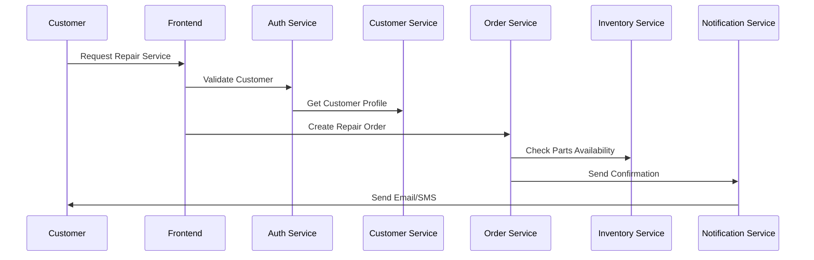
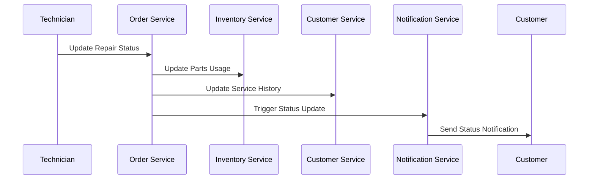
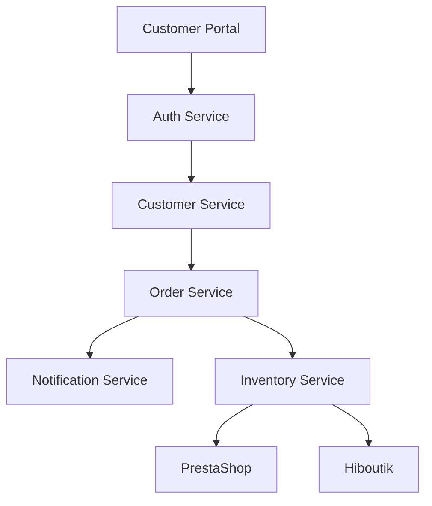
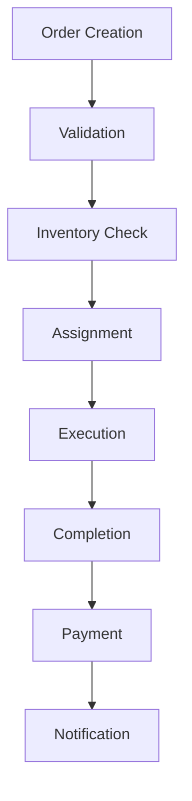
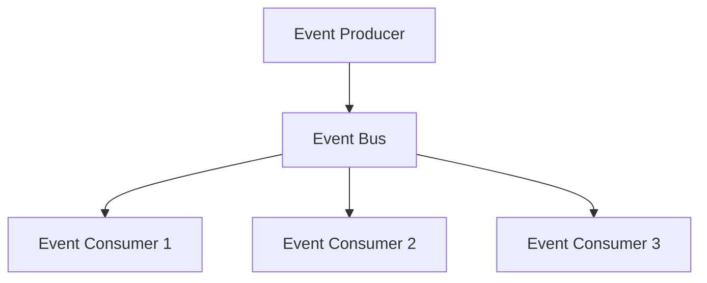
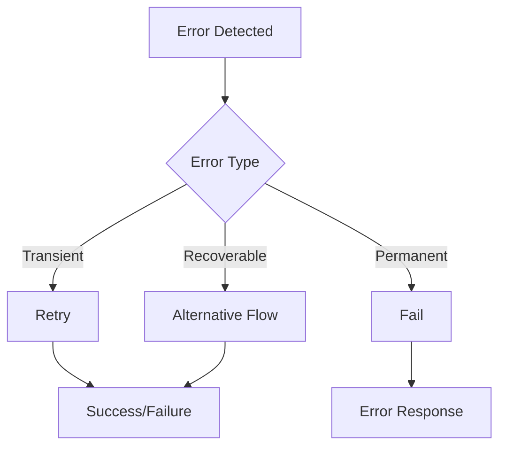
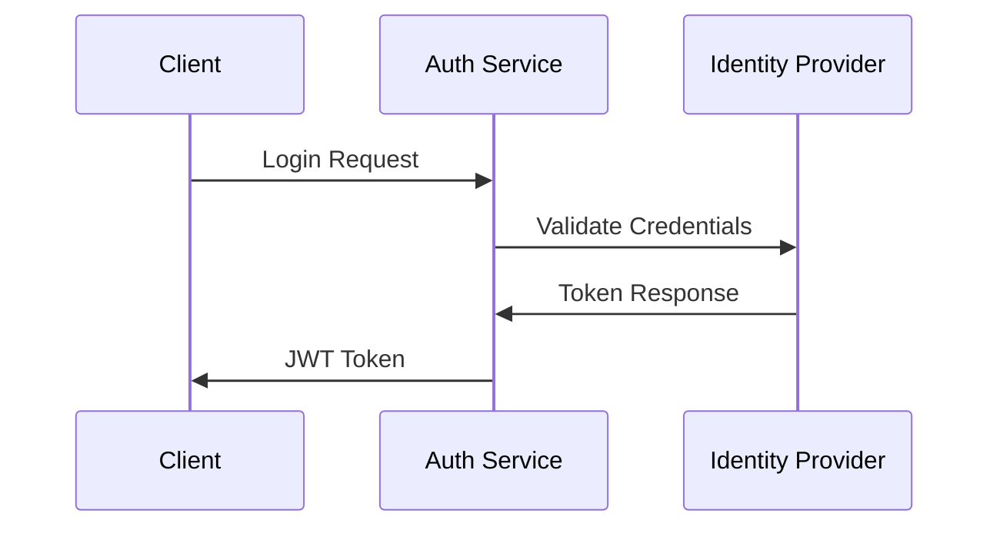
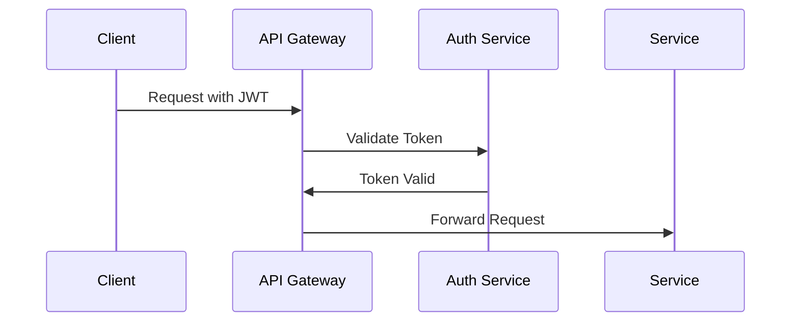

# mExpress Component Interactions

## 1. Core System Interactions

### 1.1 Customer Service Flow

### 1.2 Repair Workflow

## 2. Service Integration Points

### 2.1 E-commerce Integration

#### PrestaShop Synchronization

- **Product Catalog**

  - Real-time inventory updates
  - Price synchronization
  - Product availability status

- **Order Management**
  - Order creation in mExpress
  - Status synchronization
  - Customer data integration

### 2.2 POS Integration

#### Hiboutik Integration

- **Sales Operations**

  - Real-time transaction processing
  - Inventory updates
  - Customer profile synchronization

- **Financial Records**
  - Payment processing
  - Receipt generation
  - Daily reconciliation

### 2.3 Banking Integration

#### Qonto Integration

- **Payment Processing**

  - Transaction recording
  - Payment verification
  - Refund processing

- **Financial Reporting**
  - Transaction history
  - Revenue tracking
  - Expense management

### 2.4 Communication Integration

#### Brevo Integration

- **Email Communications**

  - Order confirmations
  - Status updates
  - Marketing campaigns

- **SMS Notifications**
  - Repair status alerts
  - Appointment reminders
  - Pickup notifications

#### Ringover Integration

- **Phone System**
  - Call tracking
  - Customer history access
  - Communication logs

## 3. Data Flow Patterns

### 3.1 Customer Data Flow

### 3.2 Order Data Flow

## 4. Integration Dependencies

### 4.1 Primary Dependencies

| Service              | Dependencies                        | Purpose                       |
| -------------------- | ----------------------------------- | ----------------------------- |
| Order Service        | Customer Service, Inventory Service | Order processing and tracking |
| Payment Service      | Qonto, Hiboutik                     | Financial transactions        |
| Notification Service | Brevo, Ringover                     | Customer communications       |
| Inventory Service    | PrestaShop, Hiboutik                | Stock management              |

### 4.2 Secondary Dependencies

| Service           | Dependencies | Purpose                  |
| ----------------- | ------------ | ------------------------ |
| Analytics Service | All Services | Business intelligence    |
| Audit Service     | All Services | Security and compliance  |
| Cache Service     | All Services | Performance optimization |

## 5. Event-Driven Architecture

### 5.1 Core Events

| Event           | Producer          | Consumers               | Purpose                 |
| --------------- | ----------------- | ----------------------- | ----------------------- |
| OrderCreated    | Order Service     | Inventory, Notification | Initiate repair process |
| StatusUpdated   | Order Service     | Notification, Customer  | Update repair status    |
| PaymentReceived | Payment Service   | Order, Accounting       | Process payment         |
| StockUpdated    | Inventory Service | PrestaShop, Hiboutik    | Sync inventory          |

### 5.2 Event Flow

## 6. API Integration Patterns

### 6.1 REST APIs

- **Internal APIs**

  - Service-to-service communication
  - Authentication required
  - Rate limited
  - Cached responses

- **External APIs**
  - Partner integration
  - Public access
  - Throttled
  - Documented

### 6.2 WebSocket Integration

- **Real-time Updates**
  - Order status changes
  - Inventory updates
  - Chat messages
  - Notifications

## 7. Error Handling

### 7.1 Error Patterns

### 7.2 Recovery Patterns

| Error Type | Recovery Strategy  | Fallback       |
| ---------- | ------------------ | -------------- |
| Network    | Retry with backoff | Cache response |
| Service    | Circuit breaker    | Degraded mode  |
| Data       | Validation retry   | Default values |

## 8. Performance Considerations

### 8.1 Caching Strategy

- **Application Cache**

  - User sessions
  - API responses
  - Configuration data

- **Database Cache**
  - Query results
  - Frequently accessed data
  - Computed values

### 8.2 Load Distribution

- **Service Distribution**
  - Load balancing
  - Service discovery
  - Health checks

## 9. Security Integration

### 9.1 Authentication Flow

### 9.2 Authorization Flow

## 10. Monitoring Integration

### 10.1 Metrics Collection

- **System Metrics**

  - CPU usage
  - Memory utilization
  - Disk I/O
  - Network traffic

- **Business Metrics**
  - Order volume
  - Processing time
  - Success rates
  - Error rates

### 10.2 Logging Strategy

- **Centralized Logging**
  - Application logs
  - Error logs
  - Audit logs
  - Performance logs

This document details the interactions between various components of the mExpress system and serves as a reference for implementation and maintenance.
