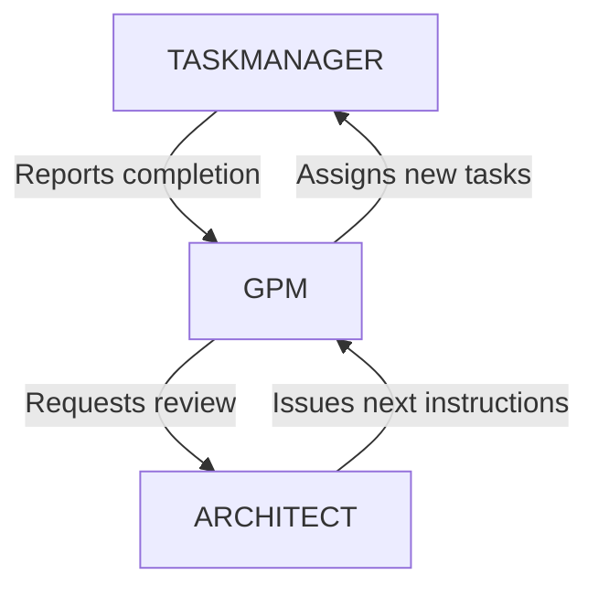

# Mode Chain Authority Structure
Version: 1.0
Status: APPROVED
Date: 2025-02-05

## Authority Hierarchy

### 1. Technical Authority
- ARCHITECT mode is the highest technical authority
- Makes final technical decisions
- Reviews milestone completions
- Provides technical direction
- Issues instructions to GPM

### 2. Milestone Completion Flow

### 3. Mode Chain Rules

#### 3.1 Architect Authority
- ARCHITECT does not report to any other mode
- ARCHITECT reviews and approves milestone completions
- ARCHITECT issues technical direction to GPM
- ARCHITECT maintains technical standards

#### 3.2 GPM Responsibilities
- Reports milestone status to ARCHITECT
- Receives technical direction from ARCHITECT
- Manages project execution through TASKMANAGER
- Maintains project timeline and resources

#### 3.3 Task Flow
1. TASKMANAGER reports task completion to GPM
2. GPM aggregates task status for milestone
3. GPM requests ARCHITECT review
4. ARCHITECT reviews and provides direction
5. GPM creates new milestone tasks
6. TASKMANAGER executes new tasks

### 4. Communication Protocols

#### 4.1 Upward Communication
- TASKMANAGER → GPM: Task completion reports
- GPM → ARCHITECT: Milestone status and review requests

#### 4.2 Downward Communication
- ARCHITECT → GPM: Technical direction and approvals
- GPM → TASKMANAGER: Task assignments and requirements

### 5. Quality Gates

#### 5.1 Task Level (TASKMANAGER)
- Implementation complete
- Tests passing
- Documentation updated
- Code quality verified

#### 5.2 Milestone Level (GPM)
- All tasks completed
- Integration verified
- Resources tracked
- Timeline maintained

#### 5.3 Architecture Level (ARCHITECT)
- Technical standards met
- Architecture integrity maintained
- Quality requirements satisfied
- Next phase direction clear

## Implementation Notes

### 1. Mode Chain Updates
- Remove any direct reporting to ASK from ARCHITECT
- Reinforce ARCHITECT → GPM flow
- Maintain clear authority structure

### 2. Documentation Updates
- Update mode chain diagrams
- Clarify reporting structures
- Document authority hierarchy

### 3. Process Improvements
- Strengthen review protocols
- Enhance quality gates
- Clarify escalation paths

## References
- /opt/mExpress/docs/standards/B_architecture.md
- /opt/mExpress/docs/standards/E_process_workflow.md