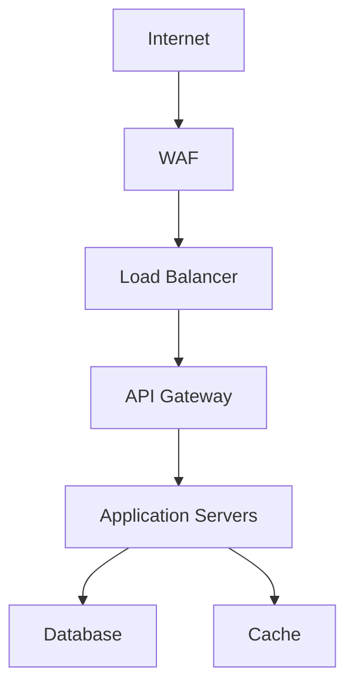

# mExpress Security Architecture

## 1. Security Overview

### 1.1 Security Principles

- Defense in depth
- Principle of least privilege
- Secure by design
- Zero trust architecture
- Regular security audits

### 1.2 Security Standards Compliance

- GDPR compliance
- PCI DSS for payment processing
- ISO 27001 security controls
- OWASP security guidelines

## 2. Authentication System

### 2.1 User Authentication

- JWT-based authentication
- Multi-factor authentication (MFA)
- Password policies:
  - Minimum 12 characters
  - Complexity requirements
  - Password history
  - Maximum age: 90 days
  - Account lockout after 5 failed attempts

### 2.2 API Authentication

- API key authentication for external services
- OAuth 2.0 for third-party integrations
- Rate limiting and throttling
- IP whitelisting for admin endpoints

## 3. Authorization Framework

### 3.1 Role-Based Access Control (RBAC)

```javascript
{
  roles: {
    admin: {
      permissions: ['*'],
      description: 'Full system access'
    },
    technician: {
      permissions: [
        'read:orders',
        'update:orders',
        'read:inventory',
        'update:inventory'
      ],
      description: 'Repair management access'
    },
    customer: {
      permissions: [
        'read:own_orders',
        'create:orders',
        'read:own_profile'
      ],
      description: 'Customer self-service access'
    }
  }
}
```

### 3.2 Resource-Level Permissions

- Object-level access control
- Data ownership validation
- Hierarchical permission structure
- Audit logging of access attempts

## 4. Data Protection

### 4.1 Data Classification

| Level  | Description             | Examples                | Protection Measures    |
| ------ | ----------------------- | ----------------------- | ---------------------- |
| High   | Sensitive personal data | Payment info, passwords | Field-level encryption |
| Medium | Business data           | Orders, inventory       | Access control         |
| Low    | Public data             | Product catalog         | Input validation       |

### 4.2 Encryption Standards

- Data at rest: AES-256
- Data in transit: TLS 1.3
- Key management through AWS KMS
- Regular key rotation

## 5. Network Security

### 5.1 Network Architecture



### 5.2 Security Controls

- Web Application Firewall (WAF)
- DDoS protection
- Network segmentation
- Intrusion Detection System (IDS)
- Regular vulnerability scanning

## 6. Application Security

### 6.1 Input Validation

- Sanitize all user inputs
- Validate request parameters
- Prevent injection attacks
- Content Security Policy (CSP)

### 6.2 Output Encoding

- HTML encoding
- JSON encoding
- URL encoding
- Prevention of XSS attacks

## 7. Session Management

### 7.1 Session Security

- Secure session handling
- Session timeout: 15 minutes
- Session invalidation on logout
- Prevention of session fixation

### 7.2 Token Management

```javascript
{
  accessToken: {
    expiry: '15m',
    algorithm: 'RS256',
    payload: {
      userId: 'string',
      role: 'string',
      permissions: ['string']
    }
  },
  refreshToken: {
    expiry: '7d',
    algorithm: 'RS256',
    payload: {
      userId: 'string',
      tokenId: 'string'
    }
  }
}
```

## 8. Audit and Logging

### 8.1 Security Logging

- Authentication attempts
- Authorization decisions
- Data access logs
- System changes
- Security events

### 8.2 Audit Trail

```javascript
{
  event: {
    type: 'string',
    severity: 'string',
    timestamp: 'date',
    actor: {
      id: 'string',
      role: 'string'
    },
    resource: {
      type: 'string',
      id: 'string'
    },
    action: 'string',
    outcome: 'string'
  }
}
```

## 9. Integration Security

### 9.1 External Services

- PrestaShop: OAuth 2.0
- Hiboutik: API key + HMAC
- Qonto: OAuth 2.0 + client certificates
- Brevo: API key
- Ringover: OAuth 2.0

### 9.2 API Security

- Request signing
- Mutual TLS authentication
- API gateway protection
- Regular security testing

## 10. Incident Response

### 10.1 Security Incident Handling

1. Detection
2. Analysis
3. Containment
4. Eradication
5. Recovery
6. Lessons learned

### 10.2 Response Procedures

- Incident classification
- Notification protocols
- Evidence collection
- System recovery
- Post-incident review

## 11. Security Monitoring

### 11.1 Real-time Monitoring

- Security event monitoring
- Anomaly detection
- Threat intelligence
- Performance monitoring
- Resource utilization

### 11.2 Alert Management

```javascript
{
  alert: {
    severity: 'string',
    type: 'string',
    source: 'string',
    timestamp: 'date',
    description: 'string',
    affectedSystems: ['string'],
    recommendations: ['string']
  }
}
```

## 12. Compliance and Privacy

### 12.1 GDPR Compliance

- Data minimization
- Purpose limitation
- Storage limitation
- Data subject rights
- Privacy by design

### 12.2 Data Protection

- Data retention policies
- Data backup procedures
- Data deletion protocols
- Privacy impact assessments

## 13. Security Testing

### 13.1 Testing Requirements

- Regular penetration testing
- Vulnerability assessments
- Security code reviews
- Compliance audits
- Performance testing

### 13.2 Security Controls Testing

- Authentication testing
- Authorization testing
- Encryption testing
- Session management testing
- Input validation testing

## 14. Security Documentation

### 14.1 Required Documentation

- Security policies
- Incident response plans
- Disaster recovery procedures
- System architecture
- Network diagrams

### 14.2 Documentation Management

- Regular reviews
- Version control
- Access control
- Update procedures
- Distribution control

This security architecture document provides the foundation for implementing and maintaining the security measures of the mExpress system.
