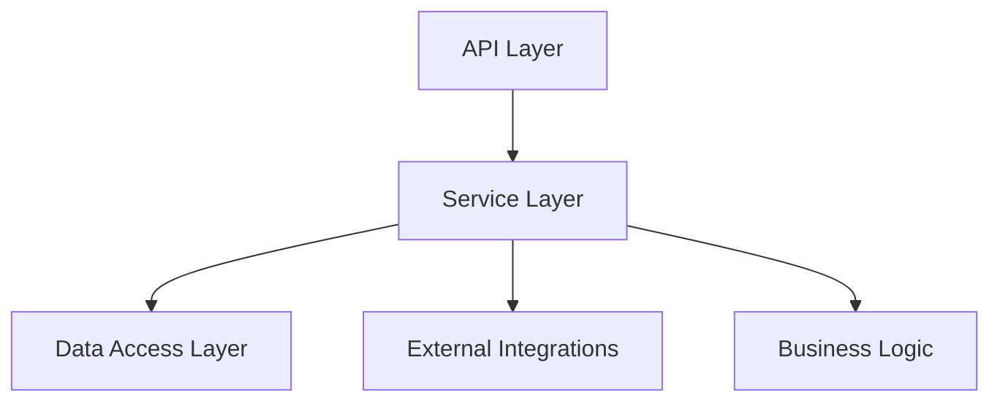

# mExpress Service Architecture

## 1. Service Layer Overview

### 1.1 Core Services



### 1.2 Service Principles

- Single Responsibility
- Dependency Injection
- Interface-based Design
- Error Handling
- Logging and Monitoring
- Transaction Management

## 2. Service Definitions

### 2.1 Customer Service

```typescript
interface ICustomerService {
  createCustomer(data: CreateCustomerDTO): Promise<Customer>;
  updateCustomer(id: string, data: UpdateCustomerDTO): Promise<Customer>;
  getCustomer(id: string): Promise<Customer>;
  getCustomerHistory(id: string): Promise<CustomerHistory>;
  deleteCustomer(id: string): Promise<void>;
}

class CustomerService implements ICustomerService {
  constructor(
    private readonly customerRepo: ICustomerRepository,
    private readonly notificationService: INotificationService,
    private readonly logger: ILogger
  ) {}

  // Implementation methods
}
```

### 2.2 Order Service

```typescript
interface IOrderService {
  createOrder(data: CreateOrderDTO): Promise<Order>;
  updateOrderStatus(id: string, status: OrderStatus): Promise<Order>;
  assignTechnician(orderId: string, technicianId: string): Promise<Order>;
  getOrderDetails(id: string): Promise<OrderDetails>;
  cancelOrder(id: string, reason: string): Promise<Order>;
}

class OrderService implements IOrderService {
  constructor(
    private readonly orderRepo: IOrderRepository,
    private readonly inventoryService: IInventoryService,
    private readonly notificationService: INotificationService,
    private readonly logger: ILogger
  ) {}

  // Implementation methods
}
```

### 2.3 Inventory Service

```typescript
interface IInventoryService {
  checkStock(itemId: string): Promise<StockInfo>;
  updateStock(itemId: string, quantity: number): Promise<void>;
  reserveParts(orderId: string, parts: OrderPart[]): Promise<void>;
  releaseParts(orderId: string): Promise<void>;
  getInventoryAlerts(): Promise<InventoryAlert[]>;
}

class InventoryService implements IInventoryService {
  constructor(
    private readonly inventoryRepo: IInventoryRepository,
    private readonly notificationService: INotificationService,
    private readonly logger: ILogger
  ) {}

  // Implementation methods
}
```

## 3. Service Communication

### 3.1 Internal Communication

```typescript
// Event-based communication
interface IEventBus {
  publish<T>(event: Event<T>): Promise<void>;
  subscribe<T>(
    eventType: string,
    handler: (event: Event<T>) => Promise<void>
  ): void;
}

// Example event
interface OrderCreatedEvent {
  orderId: string;
  customerId: string;
  items: OrderItem[];
  timestamp: Date;
}
```

### 3.2 External Communication

```typescript
interface IIntegrationService {
  syncWithPrestaShop(data: SyncData): Promise<void>;
  syncWithHiboutik(data: SyncData): Promise<void>;
  processPayment(payment: PaymentData): Promise<PaymentResult>;
  sendNotification(notification: NotificationData): Promise<void>;
}
```

## 4. Service State Management

### 4.1 State Transitions

```typescript
interface IStateManager<T> {
  transition(entity: T, newState: string): Promise<T>;
  validateTransition(currentState: string, newState: string): boolean;
  getAvailableTransitions(currentState: string): string[];
}

// Example for Order states
const orderStateManager = new StateManager<Order>({
  transitions: {
    pending: ['in_progress', 'cancelled'],
    in_progress: ['completed', 'cancelled'],
    completed: [],
    cancelled: [],
  },
});
```

### 4.2 Transaction Management

```typescript
interface ITransactionManager {
  beginTransaction(): Promise<Transaction>;
  commitTransaction(transaction: Transaction): Promise<void>;
  rollbackTransaction(transaction: Transaction): Promise<void>;
}

// Usage example
async function processOrder(order: Order): Promise<void> {
  const transaction = await transactionManager.beginTransaction();
  try {
    await orderService.createOrder(order);
    await inventoryService.reserveParts(order.id, order.parts);
    await transactionManager.commitTransaction(transaction);
  } catch (error) {
    await transactionManager.rollbackTransaction(transaction);
    throw error;
  }
}
```

## 5. Service Layer Patterns

### 5.1 Repository Pattern

```typescript
interface IRepository<T> {
  findById(id: string): Promise<T>;
  findAll(filter: Filter): Promise<T[]>;
  create(entity: T): Promise<T>;
  update(id: string, entity: Partial<T>): Promise<T>;
  delete(id: string): Promise<void>;
}

class MongoRepository<T> implements IRepository<T> {
  constructor(
    private readonly model: Model<T>,
    private readonly logger: ILogger
  ) {}

  // Implementation methods
}
```

### 5.2 Factory Pattern

```typescript
interface IServiceFactory {
  createCustomerService(): ICustomerService;
  createOrderService(): IOrderService;
  createInventoryService(): IInventoryService;
}

class ServiceFactory implements IServiceFactory {
  constructor(
    private readonly repositories: RepositoryFactory,
    private readonly logger: ILogger
  ) {}

  // Implementation methods
}
```

## 6. Error Handling

### 6.1 Service Errors

```typescript
class ServiceError extends Error {
  constructor(
    public readonly code: string,
    message: string,
    public readonly details?: any
  ) {
    super(message);
  }
}

class ValidationError extends ServiceError {
  constructor(message: string, details?: any) {
    super('VALIDATION_ERROR', message, details);
  }
}
```

### 6.2 Error Handling Strategy

```typescript
interface IErrorHandler {
  handleError(error: Error): Promise<void>;
  logError(error: Error): Promise<void>;
  notifyError(error: Error): Promise<void>;
}

class ServiceErrorHandler implements IErrorHandler {
  constructor(
    private readonly logger: ILogger,
    private readonly notificationService: INotificationService
  ) {}

  // Implementation methods
}
```

## 7. Service Monitoring

### 7.1 Performance Monitoring

```typescript
interface IPerformanceMonitor {
  startOperation(name: string): Operation;
  endOperation(operation: Operation): void;
  recordMetric(name: string, value: number): void;
  getMetrics(): ServiceMetrics;
}

class ServicePerformanceMonitor implements IPerformanceMonitor {
  // Implementation methods
}
```

### 7.2 Health Monitoring

```typescript
interface IHealthCheck {
  checkHealth(): Promise<HealthStatus>;
  getDependencyStatus(): Promise<DependencyStatus>;
  getMetrics(): ServiceMetrics;
}

class ServiceHealthCheck implements IHealthCheck {
  // Implementation methods
}
```

## 8. Service Configuration

### 8.1 Configuration Management

```typescript
interface IServiceConfig {
  loadConfig(): Promise<void>;
  getValue<T>(key: string): T;
  updateValue<T>(key: string, value: T): Promise<void>;
}

class ServiceConfig implements IServiceConfig {
  // Implementation methods
}
```

### 8.2 Feature Flags

```typescript
interface IFeatureFlag {
  isEnabled(feature: string): boolean;
  enableFeature(feature: string): Promise<void>;
  disableFeature(feature: string): Promise<void>;
}

class ServiceFeatureFlags implements IFeatureFlag {
  // Implementation methods
}
```

## 9. Service Testing

### 9.1 Unit Testing

```typescript
describe('OrderService', () => {
  let service: OrderService;
  let mockRepo: MockRepository<Order>;
  let mockInventoryService: MockInventoryService;

  beforeEach(() => {
    mockRepo = new MockRepository<Order>();
    mockInventoryService = new MockInventoryService();
    service = new OrderService(mockRepo, mockInventoryService);
  });

  // Test cases
});
```

### 9.2 Integration Testing

```typescript
describe('Order Processing Integration', () => {
  let orderService: IOrderService;
  let inventoryService: IInventoryService;
  let notificationService: INotificationService;

  beforeAll(async () => {
    // Setup services with test database
  });

  // Test cases
});
```

This service architecture document provides the foundation for implementing the service layer of the mExpress system.
