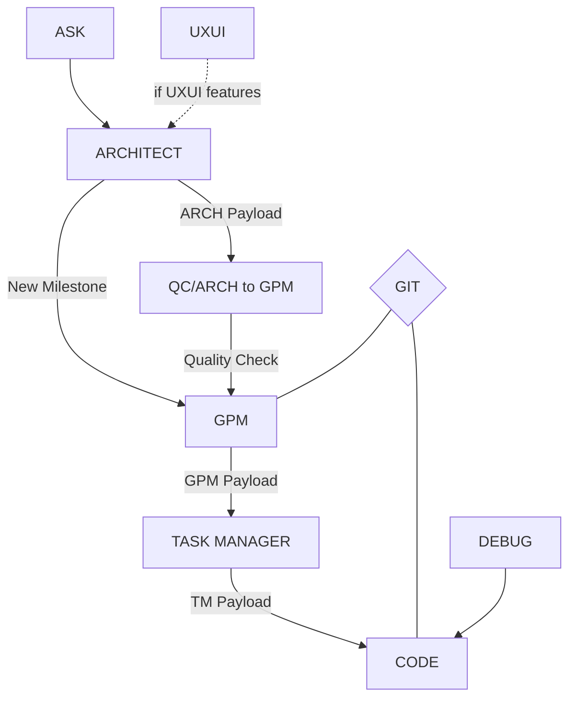

# Workflow Understanding

## 1. Core Flow

## 2. Step-by-Step Flow

### 2.1 Initial Input
1. ASK provides requirements to ARCHITECT
2. UXUI provides design input (if UI/UX features involved)

### 2.2 Architecture Phase
1. ARCHITECT receives input and:
   - Analyzes requirements from ASK
   - Reviews design specs from UXUI (if applicable)
   - Creates technical specifications
   - Makes architecture decisions

2. ARCHITECT has two paths:
   - Creates new milestone → GPM
   - Submits to QC for verification

### 2.3 Quality Control
1. QC/ARCH to GPM checkpoint:
   - Reviews architecture decisions
   - Verifies technical specifications
   - Ensures standards compliance
   - Can reject back to ARCHITECT
   - Approves to proceed to GPM

### 2.4 Project Management
1. GPM receives:
   - Verified architecture decisions
   - New milestone definitions
   - Technical specifications

2. GPM creates:
   - Project milestones
   - Resource allocations
   - Timeline planning
   - Task breakdowns

### 2.5 Task Management
1. TASK MANAGER receives GPM payload:
   - Project milestones
   - Resource assignments
   - Implementation tasks

2. TASK MANAGER creates:
   - Detailed task breakdowns
   - Implementation priorities
   - Resource assignments
   - Delivery schedules

### 2.6 Implementation
1. CODE receives TM payload:
   - Implementation tasks
   - Resource assignments
   - Technical requirements

2. CODE works with:
   - GIT for version control
   - DEBUG for error resolution

## 3. Quality Gates

### 3.1 QA/GPM Report
- Validates milestone planning
- ACCEPTED → UXUI
- REJECTED → GPM

### 3.2 QA/TASK MANAGER Report
- Validates task coordination
- ACCEPTED → GPM
- REJECTED → TASK MANAGER

### 3.3 QA/CODE Report
- Validates implementation
- ACCEPTED → TASK MANAGER
- REJECTED → CODE

## 4. Key Interactions

### 4.1 GIT Integration
- Connected to both GPM and CODE
- Centralizes code management
- Maintains version history

### 4.2 DEBUG Support
- Connected to CODE
- Provides error resolution
- Supports implementation

## 5. Payloads

### 5.1 ARCH Payload
- Technical specifications
- Architecture decisions
- System design documents
- Integration requirements

### 5.2 GPM Payload
- Project milestones
- Resource allocations
- Timeline planning
- Dependency mapping

### 5.3 TM Payload
- Task breakdowns
- Implementation priorities
- Resource assignments
- Delivery schedules

## 6. Critical Points

### 6.1 Decision Points
1. ARCHITECT to QC/GPM
2. QC approval to GPM
3. GPM to TASK MANAGER
4. TASK MANAGER to CODE

### 6.2 Quality Gates
1. QA/GPM Report
2. QA/TASK MANAGER Report
3. QA/CODE Report

### 6.3 Version Control
1. GIT integration with GPM
2. GIT integration with CODE

This workflow ensures:
1. Clear responsibility boundaries
2. Defined handoff points
3. Quality control at key stages
4. Proper version control
5. Error handling support