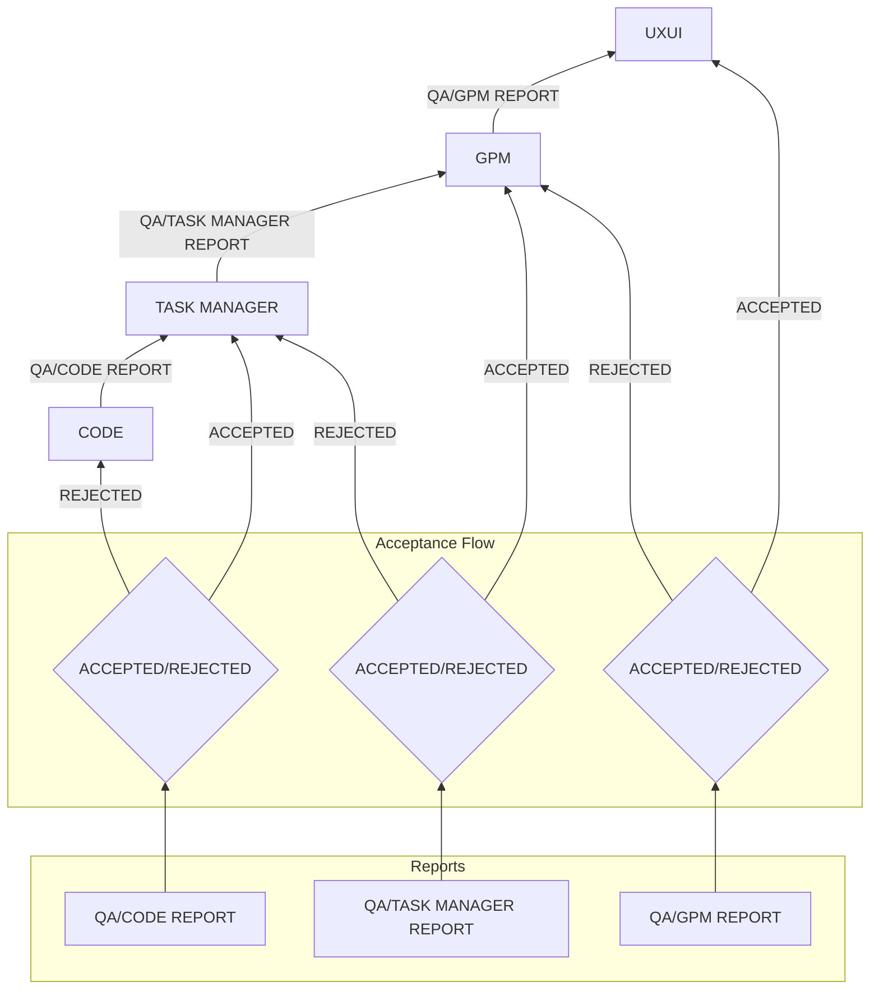

# Upstream Workflow

## 1. Report Flow Diagram

## 2. Report Types and Content

### 2.1 QA/CODE Report
- Implementation validation
- Code quality checks
- Test coverage
- Standards compliance
- When ACCEPTED → TASK MANAGER
- When REJECTED → Back to CODE

### 2.2 QA/TASK MANAGER Report
- Task completion verification
- Resource utilization
- Timeline adherence
- Implementation quality
- When ACCEPTED → GPM
- When REJECTED → Back to TASK MANAGER

### 2.3 QA/GPM Report
- Milestone achievement
- Project progress
- Resource management
- Quality metrics
- When ACCEPTED → UXUI
- When REJECTED → Back to GPM

## 3. Acceptance Criteria

### 3.1 CODE Level
- Implementation complete
- Tests passing
- Coverage thresholds met
- Documentation updated
- Standards followed

### 3.2 TASK MANAGER Level
- All tasks completed
- Resources properly utilized
- Timeline maintained
- Quality standards met
- Documentation complete

### 3.3 GPM Level
- Milestones achieved
- Project goals met
- Resources managed
- Quality maintained
- Documentation finalized

## 4. Rejection Handling

### 4.1 CODE Rejection
1. Receive QA/CODE Report
2. Address issues
3. Update implementation
4. Submit for re-review

### 4.2 TASK MANAGER Rejection
1. Receive QA/TASK MANAGER Report
2. Adjust task management
3. Update resource allocation
4. Submit for re-review

### 4.3 GPM Rejection
1. Receive QA/GPM Report
2. Revise project planning
3. Adjust milestones
4. Submit for re-review

## 5. Quality Control Integration

### 5.1 Report Verification
- Each report verified by QA
- Standard criteria applied
- Documentation reviewed
- Quality gates enforced

### 5.2 Acceptance Process
- Clear acceptance criteria
- Documented verification
- Quality metrics tracked
- Progress monitored

### 5.3 Rejection Process
- Clear feedback provided
- Issues documented
- Resolution tracked
- Re-review scheduled

## 6. Documentation Flow

### 6.1 Upstream Documentation
- QA reports
- Verification results
- Progress metrics
- Quality measurements

### 6.2 Status Tracking
- Implementation status
- Task completion
- Milestone progress
- Project health

This upstream workflow ensures:
1. Quality control at each level
2. Clear feedback paths
3. Documented progress
4. Proper issue resolution
5. Continuous improvement