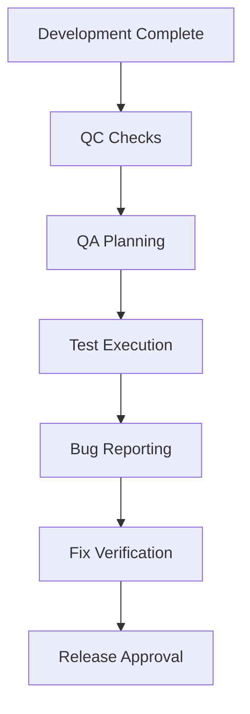
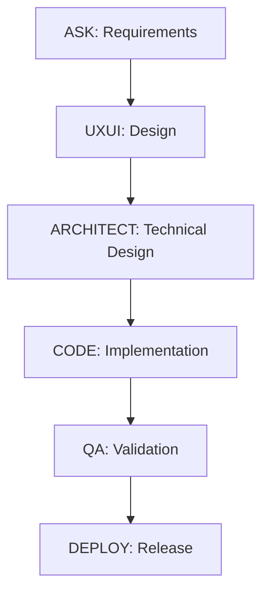

# PROJECT FOUNDATION

## Table of Contents
1. [Filesystem Structure](#filesystem-structure)
   - [Application Layout](#application-layout)
   - [Documentation Structure](#documentation-structure)
   - [Access Control](#access-control)
   - [System Links](#system-links)
   - [Backup Structure](#backup-structure)
   - [Setup Commands](#setup-commands)
2. [Version Control](#version-control)
   - [Git Workflow](#git-workflow)
   - [Commit Standards](#commit-standards)
   - [Version Tagging](#version-tagging)
   - [Quality Gates](#quality-gates)
3. [Validation Standards](#validation-standards)
   - [Setup Validation](#setup-validation)
   - [Documentation Validation](#documentation-validation)
   - [Test Validation](#test-validation)
   - [Security Validation](#security-validation)
   - [Quality Gates](#quality-gates-1)
4. [Agent Workflow Integration](#agent-workflow-integration)
   - [Agent Roles](#agent-roles)
   - [Workflow Sequences](#workflow-sequences)
   - [Communication Protocols](#communication-protocols)
   - [Handoff Procedures](#handoff-procedures)
5. [Environments](#environments)
   - [Environment Configuration](#environment-configuration)
   - [Development Environment](#development-environment)
   - [Staging Environment](#staging-environment)
   - [Production Environment](#production-environment)
   - [Environment Switch Utility](#environment-switch-utility)

## Filesystem Structure (Linux FHS Standard)

### Application Layout

#### Root Directory (/opt/mexpress/)
- backend/ # Backend application code
- frontend/ # Frontend application code
- scripts/ # Deployment and maintenance scripts

#### Variable Data (/var/lib/mexpress/)
- uploads/ # User uploaded files
- temp/ # Temporary processing files
- cache/ # Application cache

#### Logs (/var/log/mexpress/)
- access.log # HTTP access logs
- error.log # Application error logs
- audit.log # Security audit logs
- debug.log # Debug information

#### Configuration (/etc/mexpress/)
- ssl/ # SSL certificates
- nginx/ # Nginx configuration
- env/ # Environment configurations

### Access Control

#### Directory Ownership
- /opt/mexpress: $USER:$USER
- /var/lib/mexpress: www-data:www-data
- /var/log/mexpress: www-data:www-data

#### Permission Sets
- Application directories: 755
- Log directories: 744
- Upload directories: 755
- Config files: 644

### System Links

#### Symbolic Links
- logs -> /var/log/mexpress
- uploads -> /var/lib/mexpress/uploads

### Backup Structure

#### Backup Directory (/var/backups/mexpress/)
- daily/ # Daily backups
- weekly/ # Weekly backups
- monthly/ # Monthly backups

### Setup Commands

```bash
# Create directory structure
sudo mkdir -p /opt/mexpress/{backend,frontend,scripts}
sudo mkdir -p /var/lib/mexpress/{uploads,temp,cache}
sudo mkdir -p /var/log/mexpress
sudo mkdir -p /etc/mexpress/{ssl,nginx,env}
sudo mkdir -p /var/backups/mexpress/{daily,weekly,monthly}

# Set permissions
sudo chown -R $USER:$USER /opt/mexpress
sudo chown -R www-data:www-data /var/lib/mexpress
sudo chown -R www-data:www-data /var/log/mexpress

# Create symbolic links
ln -s /var/log/mexpress /opt/mexpress/logs
ln -s /var/lib/mexpress/uploads /opt/mexpress/uploads

# Validate setup
validate_setup() {
    local exit_code=0
    
    # Check directory structure
    echo "Validating directory structure..."
    local required_dirs=(
        "/opt/mexpress/backend"
        "/opt/mexpress/frontend"
        "/opt/mexpress/scripts"
        "/var/lib/mexpress/uploads"
        "/var/lib/mexpress/temp"
        "/var/lib/mexpress/cache"
        "/var/log/mexpress"
        "/etc/mexpress/ssl"
        "/etc/mexpress/nginx"
        "/etc/mexpress/env"
        "/var/backups/mexpress/daily"
        "/var/backups/mexpress/weekly"
        "/var/backups/mexpress/monthly"
    )
    
    for dir in "${required_dirs[@]}"; do
        if [[ ! -d "$dir" ]]; then
            echo "Error: Required directory $dir not found"
            exit_code=1
        fi
    done
    
    # Check permissions
    echo "Validating permissions..."
    if [[ $(stat -c '%U:%G' /opt/mexpress) != "$USER:$USER" ]]; then
        echo "Error: Incorrect ownership on /opt/mexpress"
        exit_code=1
    fi
    
    if [[ $(stat -c '%U:%G' /var/lib/mexpress) != "www-data:www-data" ]]; then
        echo "Error: Incorrect ownership on /var/lib/mexpress"
        exit_code=1
    fi
    
    if [[ $(stat -c '%U:%G' /var/log/mexpress) != "www-data:www-data" ]]; then
        echo "Error: Incorrect ownership on /var/log/mexpress"
        exit_code=1
    fi
    
    # Check symbolic links
    echo "Validating symbolic links..."
    if [[ ! -L "/opt/mexpress/logs" ]] || [[ ! -e "/opt/mexpress/logs" ]]; then
        echo "Error: Invalid or missing logs symbolic link"
        exit_code=1
    fi
    
    if [[ ! -L "/opt/mexpress/uploads" ]] || [[ ! -e "/opt/mexpress/uploads" ]]; then
        echo "Error: Invalid or missing uploads symbolic link"
        exit_code=1
    fi
    
    # Check directory permissions
    echo "Validating directory permissions..."
    if [[ $(stat -c '%a' /opt/mexpress) != "755" ]]; then
        echo "Error: Incorrect permissions on /opt/mexpress"
        exit_code=1
    fi
    
    if [[ $(stat -c '%a' /var/log/mexpress) != "744" ]]; then
        echo "Error: Incorrect permissions on /var/log/mexpress"
        exit_code=1
    fi
    
    if [[ $(stat -c '%a' /var/lib/mexpress/uploads) != "755" ]]; then
        echo "Error: Incorrect permissions on uploads directory"
        exit_code=1
    fi
    
    if [[ $exit_code -eq 0 ]]; then
        echo "Validation successful: All checks passed"
    else
        echo "Validation failed: Please review the errors above"
    fi
    
    return $exit_code
}

# Run validation after setup
validate_setup
```

## Documentation Structure

### Root Level Organization
```
/opt/mExpress/docs/
├── standards/                    # Global standards/templates
└── projects/                    # All projects root
    ├── mexpress_framework/      # Core framework project
    │   ├── core_setup/
    │   ├── service_mesh/
    │   └── message_queue/
    │
    └── {client}_{purpose}/      # Client projects
```

### Component Level Structure
Each component follows a standardized structure that supports our agent-based workflow:

```
/{component_name}/
├── business/                    # ASK Agent
│   ├── {COMP}-SPEC-DRAFT.md
│   ├── {COMP}-REQ-APPROVED.md
│   ├── {COMP}-VALUE-APPROVED.md
│   ├── {COMP}-STATUS-CURRENT.md
│   ├── acknowledgments/
│   │   ├── request-review.md
│   │   ├── scope-acceptance.md
│   │   └── handoff-checklist.md
│   ├── validation/
│   │   ├── requirements-validation.md
│   │   ├── value-validation.md
│   │   └── handoff-validation.md
│   └── handoff/
│       ├── {COMP}-HANDOFF-UXUI.md
│       └── {COMP}-HANDOFF-ARCH.md
│
├── uxui/                        # UXUI Agent
│   ├── {COMP}-DESIGN-SPEC.md
│   ├── {COMP}-COMP-SPEC.md
│   ├── {COMP}-DESIGN-STATUS.md
│   ├── acknowledgments/
│   │   ├── requirements-review.md
│   │   ├── constraints-check.md
│   │   └── handoff-checklist.md
│   ├── validation/
│   │   ├── design-validation.md
│   │   ├── accessibility-validation.md
│   │   └── handoff-validation.md
│   ├── qa/
│   │   ├── {COMP}-DESIGN-QA.md
│   │   ├── {COMP}-USABILITY-QA.md
│   │   └── {COMP}-QA-DECISION.md
│   └── handoff/
│       └── {COMP}-HANDOFF-ARCH.md
│
├── architecture/                # ARCHITECT Agent
│   ├── {COMP}-TECH-SPEC.md
│   ├── {COMP}-DESIGN-DEC.md
│   ├── {COMP}-ARCH-STATUS.md
│   ├── acknowledgments/
│   │   ├── requirements-review.md
│   │   ├── design-review.md
│   │   └── handoff-checklist.md
│   ├── validation/
│   │   ├── design-validation.md
│   │   ├── feasibility-validation.md
│   │   └── handoff-validation.md
│   ├── qa/
│   │   ├── {COMP}-ARCH-QA.md
│   │   ├── {COMP}-TECH-QA.md
│   │   └── {COMP}-QA-DECISION.md
│   └── handoff/
│       └── {COMP}-HANDOFF-GPM.md
│
├── project/                     # GPM Agent
│   ├── {COMP}-PLAN-SPEC.md
│   ├── {COMP}-RESOURCE-PLAN.md
│   ├── {COMP}-STATUS-CURRENT.md
│   ├── acknowledgments/
│   │   ├── plan-review.md
│   │   ├── resource-approval.md
│   │   └── handoff-checklist.md
│   ├── validation/
│   │   ├── plan-validation.md
│   │   ├── resource-validation.md
│   │   └── handoff-validation.md
│   └── handoff/
│       └── {COMP}-HANDOFF-CODE.md
│
├── implementation/             # CODE Agent
│   ├── {COMP}-IMPL-SPEC.md
│   ├── {COMP}-CODE-STATUS.md
│   ├── acknowledgments/
│   │   ├── code-review.md
│   │   ├── test-approval.md
│   │   └── handoff-checklist.md
│   ├── validation/
│   │   ├── code-validation.md
│   │   ├── test-validation.md
│   │   └── handoff-validation.md
│   └── handoff/
│       └── {COMP}-HANDOFF-DEBUG.md
│
├── debug/                      # DEBUG Agent
│   ├── {COMP}-DEBUG-REPORT.md
│   ├── {COMP}-FIX-STATUS.md
│   ├── acknowledgments/
│   │   ├── fix-review.md
│   │   ├── test-verification.md
│   │   └── handoff-checklist.md
│   ├── validation/
│   │   ├── fix-validation.md
│   │   ├── regression-validation.md
│   │   └── handoff-validation.md
│   └── handoff/
│       └── {COMP}-HANDOFF-GIT.md
│
└── git/                        # GIT Agent
    ├── {COMP}-MERGE-SPEC.md
    ├── {COMP}-DEPLOY-STATUS.md
    ├── acknowledgments/
    │   ├── merge-review.md
    │   ├── deploy-approval.md
    │   └── handoff-checklist.md
    ├── validation/
    │   ├── merge-validation.md
    │   ├── deploy-validation.md
    │   └── handoff-validation.md
    └── handoff/
        └── {COMP}-HANDOFF-FINAL.md
```

### Standard Directory Structure
Each agent directory contains:
1. Main documentation files
2. acknowledgments/ - Review and approval documents
3. validation/ - Validation and verification documents
4. qa/ - Quality assurance documentation (where applicable)
5. handoff/ - Handoff documentation to next agent

### QA Integration Structure
```
qa/
├── quality-gates/
│   ├── QG1-{type}.md
│   └── QG2-{type}.md
├── reports/
│   ├── {type}-qa-report.md
│   └── {aspect}-qa-report.md
└── decisions/
    ├── {type}-decision.md
    └── {aspect}-decision.md
```

### Documentation Standards

#### 1. File Organization
- All documentation must be in Markdown format
- Files must follow the standardized naming pattern:
```
{COMPONENT}-{TYPE}-{STATUS}.md
```
Where:
- COMPONENT: Project component identifier (e.g., CORE, MVP)
- TYPE: Document type (e.g., SPEC, QA)
- STATUS: Current state (e.g., DRAFT, APPROVED)

#### 2. Document Structure
Each document must include:
```markdown
# Document Title

## Metadata
- Version: x.y.z
- Last Updated: YYYY-MM-DD
- Status: [DRAFT|REVIEW|APPROVED]
- Author: [Role/Team]
- Reviewers: [Roles/Teams]

## Table of Contents
[Auto-generated ToC]

## Overview
Brief description of the document's purpose

## Content Sections
[Document-specific content]

## References
- Links to related documents
- External references

## Version History
| Version | Date | Author | Changes |
|---------|------|--------|---------|
| x.y.z   | date | author | changes |
```

#### 3. Content Guidelines
1. **Writing Style**
   - Use clear, concise language
   - Write in present tense
   - Use active voice
   - Keep paragraphs focused and brief
   - Use numbered lists for sequences
   - Use bullet points for collections

2. **Code Examples**
   - Include language identifier in code blocks
   - Provide comments for complex code
   - Use consistent indentation
   - Include example output where relevant

3. **Diagrams**
   - Use Mermaid for flowcharts and diagrams
   - Include alt text for images
   - Maintain high resolution for screenshots
   - Use consistent styling

#### 4. Version Control
1. **Version Numbering**
   - Major.Minor.Patch format
   - Major: Breaking changes
   - Minor: New features
   - Patch: Updates/fixes

2. **Change Tracking**
   - Maintain version history table
   - Document significant changes
   - Include rationale for changes
   - Link to related tickets/issues

#### 5. Review Process
1. **Review Stages**
   - Technical accuracy review
   - Content completeness review
   - Style and formatting review
   - Final approval review

2. **Review Checklist**
```markdown
- [ ] Follows naming convention
- [ ] Includes required sections
- [ ] Contains metadata
- [ ] Has version history
- [ ] Includes references
- [ ] Properly formatted
- [ ] Code examples tested
- [ ] Diagrams current
- [ ] Links validated
- [ ] Spell-checked
```

#### 6. Quality Requirements
1. **Technical Accuracy**
   - Verified by subject matter experts
   - Tested code examples
   - Validated configurations
   - Current architecture alignment

2. **Completeness**
   - All required sections present
   - Sufficient detail provided
   - Examples where needed
   - Clear explanations
   - Proper references

3. **Maintainability**
   - Regular reviews scheduled
   - Update triggers defined
   - Ownership assigned
   - Review cycle established

#### 7. Integration Requirements
1. **Business Requirements**
   - Link to business specifications
   - Traceability matrix included
   - Value proposition clear
   - Success criteria defined

2. **Technical Integration**
   - Architecture alignment verified
   - Dependencies documented
   - Integration points listed
   - Validation steps included

### File Naming Convention
All documentation files follow the standardized naming pattern:
```
{COMPONENT}-{TYPE}-{STATUS}.md
```
Where:
- COMPONENT: Project component identifier (e.g., CORE, MVP)
- TYPE: Document type (e.g., SPEC, QA)
- STATUS: Current state (e.g., DRAFT, APPROVED)

### Documentation Setup Commands
```bash
# Create base documentation structure
mkdir -p /opt/mExpress/docs/{standards,projects}
mkdir -p /opt/mExpress/docs/projects/mexpress_framework/{core_setup,service_mesh,message_queue}

# Create component structure (example for a new component)
function create_component_structure() {
    local comp_path=$1
    local comp_name=$2
    
    # Define agent structures with their specific files
    declare -A agent_files=(
        ["business"]="${comp_name}-SPEC-DRAFT.md ${comp_name}-REQ-APPROVED.md ${comp_name}-VALUE-APPROVED.md ${comp_name}-STATUS-CURRENT.md"
        ["uxui"]="${comp_name}-DESIGN-SPEC.md ${comp_name}-COMP-SPEC.md ${comp_name}-DESIGN-STATUS.md"
        ["architecture"]="${comp_name}-TECH-SPEC.md ${comp_name}-DESIGN-DEC.md ${comp_name}-ARCH-STATUS.md"
        ["project"]="${comp_name}-PLAN-SPEC.md ${comp_name}-RESOURCE-PLAN.md ${comp_name}-STATUS-CURRENT.md"
        ["implementation"]="${comp_name}-IMPL-SPEC.md ${comp_name}-CODE-STATUS.md"
        ["debug"]="${comp_name}-DEBUG-REPORT.md ${comp_name}-FIX-STATUS.md"
        ["git"]="${comp_name}-MERGE-SPEC.md ${comp_name}-DEPLOY-STATUS.md"
    )

    # Define standard subdirectories for each agent
    declare -A agent_subdirs=(
        ["business"]="acknowledgments/{request-review,scope-acceptance,handoff-checklist}.md validation/{requirements-validation,value-validation,handoff-validation}.md handoff/{${comp_name}-HANDOFF-UXUI,${comp_name}-HANDOFF-ARCH}.md"
        ["uxui"]="acknowledgments/{requirements-review,constraints-check,handoff-checklist}.md validation/{design-validation,accessibility-validation,handoff-validation}.md qa/{${comp_name}-DESIGN-QA,${comp_name}-USABILITY-QA,${comp_name}-QA-DECISION}.md handoff/${comp_name}-HANDOFF-ARCH.md"
        ["architecture"]="acknowledgments/{requirements-review,design-review,handoff-checklist}.md validation/{design-validation,feasibility-validation,handoff-validation}.md qa/{${comp_name}-ARCH-QA,${comp_name}-TECH-QA,${comp_name}-QA-DECISION}.md handoff/${comp_name}-HANDOFF-GPM.md"
        ["project"]="acknowledgments/{plan-review,resource-approval,handoff-checklist}.md validation/{plan-validation,resource-validation,handoff-validation}.md handoff/${comp_name}-HANDOFF-CODE.md"
        ["implementation"]="acknowledgments/{code-review,test-approval,handoff-checklist}.md validation/{code-validation,test-validation,handoff-validation}.md handoff/${comp_name}-HANDOFF-DEBUG.md"
        ["debug"]="acknowledgments/{fix-review,test-verification,handoff-checklist}.md validation/{fix-validation,regression-validation,handoff-validation}.md handoff/${comp_name}-HANDOFF-GIT.md"
        ["git"]="acknowledgments/{merge-review,deploy-approval,handoff-checklist}.md validation/{merge-validation,deploy-validation,handoff-validation}.md handoff/${comp_name}-HANDOFF-FINAL.md"
    )

    # Create directories and files for each agent
    for agent in "${!agent_files[@]}"; do
        # Create base agent directory
        mkdir -p "$comp_path/$agent"
        
        # Create main documentation files
        for file in ${agent_files[$agent]}; do
            touch "$comp_path/$agent/$file"
        done

        # Create subdirectories and their files
        for subdir_files in ${agent_subdirs[$agent]}; do
            mkdir -p "$(dirname "$comp_path/$agent/$subdir_files")"
            touch "$comp_path/$agent/$subdir_files"
        done

        # Add qa directory for applicable agents
        if [ "$agent" != "business" ] && [ "$agent" != "project" ]; then
            mkdir -p "$comp_path/$agent/qa"
        fi
    done
    
    # Create QA structure
    mkdir -p "$comp_path/qa"/{quality-gates,reports,decisions}
    touch "$comp_path/qa/quality-gates/QG1-${comp_name}.md"
    touch "$comp_path/qa/quality-gates/QG2-${comp_name}.md"
    touch "$comp_path/qa/reports/${comp_name}-qa-report.md"
    touch "$comp_path/qa/decisions/${comp_name}-decision.md"
}

# Usage example:
# create_component_structure "/opt/mExpress/docs/projects/new_component" "NEWCOMP"
```

## Version Control

### Git Workflow
The project follows a structured git workflow based on Business Request (BRQ) patterns:

1. **Branch Types**
   - `main` - Production-ready code
   - `brq/YYYY-NNN` - Business request branches
   - `brq/YYYY-NNN/TN` - Task-specific branches
   - `hotfix/YYYY-NNN` - Emergency fixes

2. **Branch Naming Convention**
```
brq/YYYY-NNN[-TN][-description]
```
Where:
- YYYY: Year (e.g., 2025)
- NNN: Sequential request number (e.g., 001)
- TN: Task number (e.g., T1, T2)
- description: Optional brief description

Example: `brq/2025-002-T2-service-mesh`

### Commit Standards

1. **Commit Message Format**
```
<type>: <subject>

<body>

<footer>
```

2. **Types**
- feat: New feature
- fix: Bug fix
- refactor: Code refactoring
- style: Formatting changes
- docs: Documentation changes
- test: Test-related changes
- chore: Maintenance tasks

3. **Guidelines**
- Subject: Imperative mood, no period
- Body: Explain what and why (not how)
- Footer: Reference JIRA tickets

Example:
```
feat: add user authentication system

Implement JWT-based authentication system with refresh tokens
to secure API endpoints and manage user sessions.

JIRA: AUTH-123
```

### Version Tagging

1. **Version Format**
```
v<major>.<minor>.<patch>[-<stage>]
```
Where:
- major: Breaking changes
- minor: New features
- patch: Bug fixes
- stage: Optional (alpha, beta, rc)

2. **Tag Creation**
```bash
# Create annotated tag
git tag -a v1.2.0 -m "Release version 1.2.0"

# Push tags
git push origin --tags
```

3. **Release Branches**
- Create: `release/v1.2.x`
- Merge to: main and develop
- Tag: On main post-merge

### Quality Gates

1. **Pre-Commit**
- Linting checks
- Type checking
- Unit tests
- Commit message format

2. **Pre-Merge**
- Integration tests
- Code coverage
- Security scans
- Documentation updates

3. **Release**
- Performance tests
- Security audit
- Documentation review
- Version tag creation

## Validation Standards

### Setup Validation

1. **Infrastructure Validation**
```bash
# Directory Structure
validate_directories() {
    local required_dirs=(
        "/opt/mexpress"
        "/var/lib/mexpress"
        "/var/log/mexpress"
        "/etc/mexpress"
        "/var/backups/mexpress"
    )
    
    for dir in "${required_dirs[@]}"; do
        if [[ ! -d "$dir" ]]; then
            echo "Error: Required directory $dir not found"
            return 1
        fi
    done
}

# Permission Validation
validate_permissions() {
    # Check ownership
    [[ $(stat -c '%U:%G' /opt/mexpress) == "$USER:$USER" ]] || return 1
    [[ $(stat -c '%U:%G' /var/lib/mexpress) == "www-data:www-data" ]] || return 1
    
    # Check modes
    [[ $(stat -c '%a' /opt/mexpress) == "755" ]] || return 1
    [[ $(stat -c '%a' /var/log/mexpress) == "744" ]] || return 1
}
```

2. **Configuration Validation**
```typescript
interface ValidationResult {
    valid: boolean;
    errors: string[];
}

class ConfigValidator {
    static async validateEnvironment(): Promise<ValidationResult> {
        const checks = [
            this.validateDatabaseConfig(),
            this.validateCacheConfig(),
            this.validateSecurityConfig(),
            this.validateLoggingConfig()
        ];

        const results = await Promise.all(checks);
        return {
            valid: results.every(r => r.valid),
            errors: results.flatMap(r => r.errors)
        };
    }
}
```

### Documentation Validation

1. **Structure Validation**
- Directory hierarchy matches standard
- Required files present
- Naming conventions followed
- Documentation completeness

2. **Content Validation**
- Technical accuracy
- Completeness of sections
- Code example validity
- Link integrity

3. **Quality Validation**
- Grammar and spelling
- Formatting consistency
- Image quality and relevance
- Code block syntax

### Test Validation

1. **Unit Tests**
```typescript
const testValidation = {
    coverage: {
        statements: 80,
        branches: 70,
        functions: 80,
        lines: 80
    },
    execution: {
        timeout: 5000,
        maxWorkers: 4,
        bail: true
    },
    reporting: {
        verbose: true,
        ci: true
    }
};
```

2. **Integration Tests**
- API endpoint validation
- Database interaction tests
- Cache operation verification
- Service communication checks

3. **Performance Tests**
- Response time thresholds
- Concurrent user simulation
- Resource usage monitoring
- Load test parameters

### Security Validation

1. **Code Security**
- Static analysis
- Dependency scanning
- Secret detection
- SAST implementation

2. **Infrastructure Security**
- Port scanning
- SSL/TLS validation
- Access control verification
- Backup integrity checks

3. **Application Security**
- Authentication validation
- Authorization checks
- Input validation
- Output sanitization

### Quality Gates

1. **Development Gates**
- Code review completed
- Tests passing
- Coverage thresholds met
- Linting standards met

2. **Staging Gates**
- Integration tests passed
- Performance benchmarks met
- Security scans passed
- Documentation updated

3. **Production Gates**
- Load testing completed
- Security audit passed
- Backup verification
- Rollback tested

### QA/QC Integration Framework

#### 1. Quality Control (QC) Points
1. **Implementation QC**
   - Code style validation
   - Unit test coverage
   - Integration test coverage
   - Performance benchmarks
   - Security standards
   - Documentation completeness

2. **Automated QC Checks**
```typescript
interface QCResult {
    passed: boolean;
    category: string;
    checks: {
        name: string;
        status: 'passed' | 'failed';
        details?: string;
    }[];
}

class QualityControl {
    static async validateImplementation(): Promise<QCResult[]> {
        return [
            await this.validateCodeStyle(),
            await this.validateTestCoverage(),
            await this.validatePerformance(),
            await this.validateSecurity(),
            await this.validateDocumentation()
        ];
    }
}
```

3. **Manual QC Reviews**
```markdown
# QC Review Checklist
## Code Review
- [ ] Follows style guide
- [ ] Properly documented
- [ ] Error handling
- [ ] Edge cases covered
- [ ] Performance considered

## Test Review
- [ ] Test cases complete
- [ ] Edge cases covered
- [ ] Mocks appropriate
- [ ] Integration tests
- [ ] Performance tests

## Documentation Review
- [ ] All sections complete
- [ ] Examples provided
- [ ] API documented
- [ ] Error cases covered
- [ ] Configuration documented
```

#### 2. Quality Assurance (QA) Integration
1. **QA Process Flow**


2. **QA Test Levels**
```typescript
enum TestLevel {
    Unit = 'unit',
    Integration = 'integration',
    System = 'system',
    Acceptance = 'acceptance'
}

interface TestCase {
    level: TestLevel;
    category: string;
    description: string;
    steps: string[];
    expectedResult: string;
    actualResult?: string;
    status?: 'passed' | 'failed';
}

class QATestManager {
    static async executeTestSuite(level: TestLevel): Promise<TestResult> {
        const testCases = await this.loadTestCases(level);
        const results = await this.executeTests(testCases);
        await this.reportResults(results);
        return this.generateTestSummary(results);
    }
}
```

3. **QA Documentation**
```markdown
# QA Test Plan
## Test Scope
- Feature coverage
- Test levels
- Environment requirements
- Test data requirements

## Test Cases
- Functional tests
- Integration tests
- Performance tests
- Security tests
- Usability tests

## Test Execution
- Test environment
- Test schedule
- Resource allocation
- Risk mitigation

## Reporting
- Test results
- Bug reports
- Test metrics
- Release recommendations
```

#### 3. Integration Points
1. **Development to QC**
   - Pre-commit hooks
   - Automated style checks
   - Unit test execution
   - Coverage reporting
   - Documentation validation

2. **QC to QA**
   - Test environment setup
   - Test data preparation
   - Test case handoff
   - Defect tracking setup
   - Monitoring configuration

3. **QA to Release**
   - Test completion report
   - Bug status report
   - Performance metrics
   - Security assessment
   - Release recommendation

#### 4. Quality Metrics
```typescript
interface QualityMetrics {
    code: {
        coverage: {
            statements: number;
            branches: number;
            functions: number;
            lines: number;
        };
        complexity: {
            cyclomatic: number;
            cognitive: number;
        };
        maintainability: {
            index: number;
            rating: 'A' | 'B' | 'C' | 'D' | 'F';
        };
    };
    testing: {
        coverage: {
            functional: number;
            integration: number;
            system: number;
        };
        execution: {
            passed: number;
            failed: number;
            blocked: number;
            total: number;
        };
        defects: {
            critical: number;
            major: number;
            minor: number;
        };
    };
    documentation: {
        coverage: {
            api: number;
            features: number;
            configuration: number;
        };
        completeness: {
            required: number;
            optional: number;
            examples: number;
        };
        accuracy: {
            technical: number;
            functional: number;
            configuration: number;
        };
    };
}
```

## Agent Workflow Integration

### Agent Roles

1. **ASK Agent (Business Analysis)**
- Requirements gathering and validation
- Business value assessment
- Stakeholder communication
- Project scope definition
```markdown
Documentation Path: business/
Key Files:
- {COMP}-SPEC-DRAFT.md
- {COMP}-REQ-APPROVED.md
- {COMP}-VALUE-APPROVED.md
- {COMP}-STATUS-CURRENT.md
```

2. **UXUI Agent (Design)**
- User interface design
- User experience flows
- Component specifications
- Design system compliance
```markdown
Documentation Path: uxui/
Key Files:
- {COMP}-DESIGN-SPEC.md
- {COMP}-COMP-SPEC.md
- {COMP}-DESIGN-STATUS.md
```

3. **ARCHITECT Agent (Technical Design)**
- Technical architecture
- System design decisions
- Integration patterns
- Performance considerations
```markdown
Documentation Path: architecture/
Key Files:
- {COMP}-TECH-SPEC.md
- {COMP}-DESIGN-DEC.md
- {COMP}-ARCH-STATUS.md
```

### Workflow Sequences

1. **Standard Development Flow**


2. **Quality Control Points**
- Requirements validation (ASK → UXUI)
- Design review (UXUI → ARCHITECT)
- Technical validation (ARCHITECT → CODE)
- Implementation verification (CODE → QA)
- Release approval (QA → DEPLOY)

### Communication Protocols

1. **Handoff Documentation**
```markdown
/{agent}/handoff/
├── {COMP}-HANDOFF-{NEXT_AGENT}.md
└── acknowledgments/
    ├── handoff-checklist.md
    └── handoff-validation.md
```

2. **Review Process**
- Documentation review
- Validation checks
- Acceptance criteria
- Sign-off requirements

### Handoff Procedures

1. **Documentation Requirements**
```markdown
# Handoff Checklist
- [ ] All required documents completed
- [ ] Validation tests passed
- [ ] Review comments addressed
- [ ] Dependencies documented
- [ ] Risks identified
```

2. **Quality Gates**
- Documentation completeness
- Validation success
- Review approval
- Dependency check
- Risk assessment

3. **Handoff Steps**
```bash
# Handoff process
1. Complete documentation
2. Run validation checks
3. Request review
4. Address feedback
5. Obtain approval
6. Transfer ownership
```

## Environments

### Environment Configuration

#### Base Configuration
```typescript
// config/environment.ts
interface EnvironmentConfig {
  app: {
    name: string;
    version: string;
    port: number;
    apiUrl: string;
    corsOrigins: string[];
  };
  database: {
    uri: string;
    poolSize: number;
    retryWrites: boolean;
  };
  cache: {
    host: string;
    port: number;
    ttl: number;
  };
  security: {
    jwtSecret: string;
    jwtExpiry: string;
    bcryptRounds: number;
  };
}

// Base configuration implementation
const getEnvironmentConfig = (env: string): EnvironmentConfig => {
  const baseConfig: EnvironmentConfig = {
    app: {
      name: 'mExpress',
      version: process.env.npm_package_version || '1.0.0',
      port: parseInt(process.env.PORT || '3000', 10),
      apiUrl: process.env.API_URL || 'http://localhost:3000',
      corsOrigins: process.env.CORS_ORIGINS?.split(',') || ['*'],
    },
    database: {
      uri: process.env.MONGODB_URI || 'mongodb://localhost:27017/mexpress',
      poolSize: parseInt(process.env.DB_POOL_SIZE || '10', 10),
      retryWrites: true,
    },
    cache: {
      host: process.env.REDIS_HOST || 'localhost',
      port: parseInt(process.env.REDIS_PORT || '6379', 10),
      ttl: parseInt(process.env.CACHE_TTL || '3600', 10),
    },
    security: {
      jwtSecret: process.env.JWT_SECRET || 'development-secret',
      jwtExpiry: process.env.JWT_EXPIRY || '1h',
      bcryptRounds: parseInt(process.env.BCRYPT_ROUNDS || '12', 10),
    },
  };

  return baseConfig;
};
```

### Development Environment

#### Development Configuration
```typescript
// config/environments/development.ts
const developmentConfig: Partial<EnvironmentConfig> = {
  app: {
    corsOrigins: ['*'],
  },
  database: {
    uri: 'mongodb://localhost:27017/mexpress_dev',
  },
  cache: {
    ttl: 60, // Short cache for development
  },
  security: {
    jwtExpiry: '24h', // Longer token life for development
  },
};

// Development specific features
const developmentFeatures = {
  enableDebugLogs: true,
  enableSwagger: true,
  mockThirdPartyServices: true,
  disableRateLimiting: true,
  hotReload: true,
};
```

#### Development Tools
```typescript
// utils/development.ts
class DevelopmentTools {
  // API request logger
  static requestLogger = (req: Request, res: Response, next: NextFunction) => {
    console.log(`[${new Date().toISOString()}] ${req.method} ${req.url}`);
    console.log('Headers:', req.headers);
    console.log('Body:', req.body);
    next();
  };

  // Error stack trace enhancement
  static enhanceError = (err: Error) => {
    Error.stackTraceLimit = Infinity;
    return err;
  };

  // Development-only routes
  static registerDevRoutes = (app: Express) => {
    if (process.env.NODE_ENV === 'development') {
      app.get('/dev/routes', (req, res) => {
        const routes = app._router.stack
          .filter(r => r.route)
          .map(r => ({
            path: r.route.path,
            methods: Object.keys(r.route.methods),
          }));
        res.json(routes);
      });
    }
  };
}
```

### Staging Environment

#### Staging Configuration
```typescript
// config/environments/staging.ts
const stagingConfig: Partial<EnvironmentConfig> = {
  app: {
    corsOrigins: ['https://staging.mexpress.com'],
  },
  database: {
    uri: process.env.STAGING_DB_URI,
    poolSize: 20,
  },
  cache: {
    ttl: 300, // 5 minutes cache
  },
  security: {
    jwtExpiry: '2h',
  },
};

// Staging monitoring setup
const stagingMonitoring = {
  metrics: {
    enabled: true,
    interval: 60000, // 1 minute
    retention: '7d',
  },
  logging: {
    level: 'debug',
    format: 'json',
    filename: '/var/log/mexpress/staging.log',
  },
  alerts: {
    enabled: true,
    endpoints: [
      'https://alerts.mexpress.com/staging',
      'mailto:devs@mexpress.com',
    ],
  },
};
```

#### Staging Validation
```typescript
// utils/staging-validator.ts
class StagingValidator {
  static async validateEnvironment(): Promise<boolean> {
    const checks = [
      this.checkDatabaseConnection(),
      this.checkRedisConnection(),
      this.checkExternalServices(),
      this.checkFilePermissions(),
      this.checkCertificates(),
    ];

    try {
      const results = await Promise.all(checks);
      return results.every(result => result === true);
    } catch (error) {
      logger.error('Staging validation failed:', error);
      return false;
    }
  }

  static async checkExternalServices(): Promise<boolean> {
    const services = [
      'https://api.hiboutik.com/health',
      'https://api.brevo.com/health',
      'https://api.qonto.com/health',
    ];

    const results = await Promise.all(
      services.map(service =>
        axios
          .get(service)
          .then(() => true)
          .catch(() => false)
      )
    );

    return results.every(result => result === true);
  }
}
```

### Production Environment

#### Production Configuration
```typescript
// config/environments/production.ts
const productionConfig: Partial<EnvironmentConfig> = {
  app: {
    corsOrigins: ['https://mexpress.com'],
  },
  database: {
    uri: process.env.PROD_DB_URI,
    poolSize: 50,
    retryWrites: true,
  },
  cache: {
    ttl: 3600, // 1 hour cache
    host: process.env.PROD_REDIS_HOST,
    port: parseInt(process.env.PROD_REDIS_PORT || '6379', 10),
  },
  security: {
    jwtExpiry: '1h',
    bcryptRounds: 12,
  },
};

// Production security enhancements
const productionSecurity = {
  helmet: {
    contentSecurityPolicy: {
      directives: {
        defaultSrc: ["'self'"],
        scriptSrc: ["'self'"],
        styleSrc: ["'self'"],
        imgSrc: ["'self'", 'data:', 'https:'],
      },
    },
    hsts: {
      maxAge: 31536000,
      includeSubDomains: true,
      preload: true,
    },
  },
  rateLimit: {
    windowMs: 15 * 60 * 1000, // 15 minutes
    max: 100, // limit each IP to 100 requests per windowMs
  },
};
```

#### Production Monitoring
```typescript
// monitoring/production.ts
class ProductionMonitoring {
  private metrics: MetricsService;
  private alerts: AlertService;

  constructor() {
    this.metrics = new MetricsService({
      interval: 30000, // 30 seconds
      retention: '30d',
      alertThresholds: {
        cpu: 80, // 80% CPU usage
        memory: 85, // 85% memory usage
        disk: 90, // 90% disk usage
        errors: 50, // 50 errors per minute
      },
    });

    this.alerts = new AlertService({
      channels: ['slack', 'email', 'pager'],
      escalationPolicy: {
        level1: 'devops-team',
        level2: 'engineering-lead',
        level3: 'cto',
      },
    });
  }

  async monitorHealthMetrics(): Promise<void> {
    const metrics = await this.collectMetrics();
    await this.evaluateMetrics(metrics);
    await this.storeMetrics(metrics);
  }

  private async evaluateMetrics(metrics: SystemMetrics): Promise<void> {
    if (metrics.errorRate > 50 || metrics.responseTime > 500) {
      await this.alerts.trigger('HIGH_ERROR_RATE', metrics);
    }
  }
}
```

### Deployment and Rollback Procedures

#### Deployment Process
```bash
#!/bin/bash

deploy() {
    local environment=$1
    local version=$2
    local timestamp=$(date +%Y%m%d_%H%M%S)
    local deploy_log="/var/log/mexpress/deployments/${timestamp}_${environment}_deploy.log"
    
    echo "Starting deployment to $environment environment - Version: $version"
    
    # 1. Pre-deployment checks
    pre_deployment_check() {
        echo "Running pre-deployment checks..."
        
        # Check system resources
        if [[ $(df -h / | awk 'NR==2 {print $5}' | sed 's/%//') -gt 90 ]]; then
            echo "Error: Insufficient disk space"
            return 1
        }
        
        # Verify required services
        services=("nginx" "mongodb" "redis")
        for service in "${services[@]}"; do
            if ! systemctl is-active --quiet $service; then
                echo "Error: $service is not running"
                return 1
            fi
        done
        
        return 0
    }
    
    # 2. Create backup
    create_backup() {
        echo "Creating backup..."
        tar -czf "/var/backups/mexpress/${timestamp}_pre_deploy.tar.gz" /opt/mexpress
        if [[ $? -ne 0 ]]; then
            echo "Error: Backup failed"
            return 1
        fi
        return 0
    }
    
    # 3. Deploy new version
    deploy_new_version() {
        echo "Deploying version $version..."
        
        # Stop application
        systemctl stop mexpress
        
        # Update application files
        cd /opt/mexpress
        git fetch origin
        git checkout $version
        
        # Install dependencies
        npm install --production
        
        # Run migrations
        npm run migrate
        
        # Start application
        systemctl start mexpress
        
        # Verify deployment
        sleep 5
        if ! systemctl is-active --quiet mexpress; then
            echo "Error: Application failed to start"
            return 1
        fi
        
        return 0
    }
    
    # Execute deployment steps
    {
        if ! pre_deployment_check; then
            echo "Pre-deployment checks failed"
            return 1
        fi
        
        if ! create_backup; then
            echo "Backup failed"
            return 1
        fi
        
        if ! deploy_new_version; then
            echo "Deployment failed"
            rollback "$timestamp"
            return 1
        fi
        
        echo "Deployment successful"
        return 0
        
    } 2>&1 | tee "$deploy_log"
}

# Usage: deploy "production" "v1.2.3"
```

#### Rollback Procedures
```bash
#!/bin/bash

rollback() {
    local timestamp=$1
    local rollback_log="/var/log/mexpress/deployments/${timestamp}_rollback.log"
    
    echo "Initiating rollback procedure..."
    
    {
        # 1. Stop current version
        echo "Stopping current version..."
        systemctl stop mexpress
        
        # 2. Restore from backup
        echo "Restoring from backup..."
        cd /var/backups/mexpress
        latest_backup=$(ls -t *_pre_deploy.tar.gz | head -n1)
        
        if [[ -f "$latest_backup" ]]; then
            rm -rf /opt/mexpress/*
            tar -xzf "$latest_backup" -C /
            
            # 3. Restore dependencies
            cd /opt/mexpress
            npm install --production
            
            # 4. Start previous version
            systemctl start mexpress
            
            # 5. Verify rollback
            sleep 5
            if systemctl is-active --quiet mexpress; then
                echo "Rollback successful"
                return 0
            else
                echo "Error: Application failed to start after rollback"
                return 1
            fi
        else
            echo "Error: No backup found for rollback"
            return 1
        fi
        
    } 2>&1 | tee "$rollback_log"
}

# Usage: rollback "20250211_123456"
```

#### Deployment Validation
```typescript
// utils/deployment-validator.ts
class DeploymentValidator {
    static async validateDeployment(version: string): Promise<boolean> {
        try {
            // 1. Version check
            const deployedVersion = await this.getDeployedVersion();
            if (deployedVersion !== version) {
                throw new Error('Version mismatch');
            }
            
            // 2. Health check
            const health = await this.checkApplicationHealth();
            if (!health.healthy) {
                throw new Error('Health check failed');
            }
            
            // 3. Database check
            const dbConnection = await this.validateDatabaseConnection();
            if (!dbConnection) {
                throw new Error('Database connection failed');
            }
            
            // 4. Cache check
            const cacheConnection = await this.validateCacheConnection();
            if (!cacheConnection) {
                throw new Error('Cache connection failed');
            }
            
            // 5. API check
            const apiStatus = await this.validateAPIEndpoints();
            if (!apiStatus.success) {
                throw new Error('API validation failed');
            }
            
            return true;
        } catch (error) {
            logger.error('Deployment validation failed:', error);
            return false;
        }
    }
    
    static async validateRollback(timestamp: string): Promise<boolean> {
        try {
            // 1. Application status
            if (!await this.checkApplicationStatus()) {
                throw new Error('Application is not running');
            }
            
            // 2. Database integrity
            if (!await this.checkDatabaseIntegrity()) {
                throw new Error('Database integrity check failed');
            }
            
            // 3. Service health
            const services = ['nginx', 'mongodb', 'redis'];
            for (const service of services) {
                if (!await this.checkServiceHealth(service)) {
                    throw new Error(`${service} health check failed`);
                }
            }
            
            return true;
        } catch (error) {
            logger.error('Rollback validation failed:', error);
            return false;
        }
    }
}
```

### Environment Switch Utility
```typescript
// utils/environment-switcher.ts
class EnvironmentSwitcher {
  static async switchTo(
    env: 'development' | 'staging' | 'production'
  ): Promise<void> {
    // 1. Load environment-specific configuration
    const config = await this.loadConfig(env);

    // 2. Configure services
    await this.configureServices(config);

    // 3. Run environment-specific validations
    await this.validateEnvironment(env);

    // 4. Update monitoring
    await this.updateMonitoring(env);

    logger.info(`Successfully switched to ${env} environment`);
  }

  private static async validateEnvironment(env: string): Promise<void> {
    const validator =
      env === 'staging' ? new StagingValidator() : new ProductionValidator();

    const isValid = await validator.validateEnvironment();
    if (!isValid) {
      throw new Error(`Environment validation failed for ${env}`);
    }
  }
}
```

### Summary of Environment Configurations

The environment configurations established above provide:

#### Key Features
- Clear separation between environments
- Environment-specific security measures
- Appropriate monitoring and logging
- Validation and health checks
- Production-ready configurations
- Development tools and conveniences
- Staging environment for testing

#### Implementation Notes
- Each environment is fully isolated
- Security measures are progressively enhanced from development to production
- Monitoring and logging are tailored to each environment's needs
- Comprehensive validation ensures environment integrity
- Easy switching between environments via utility functions
