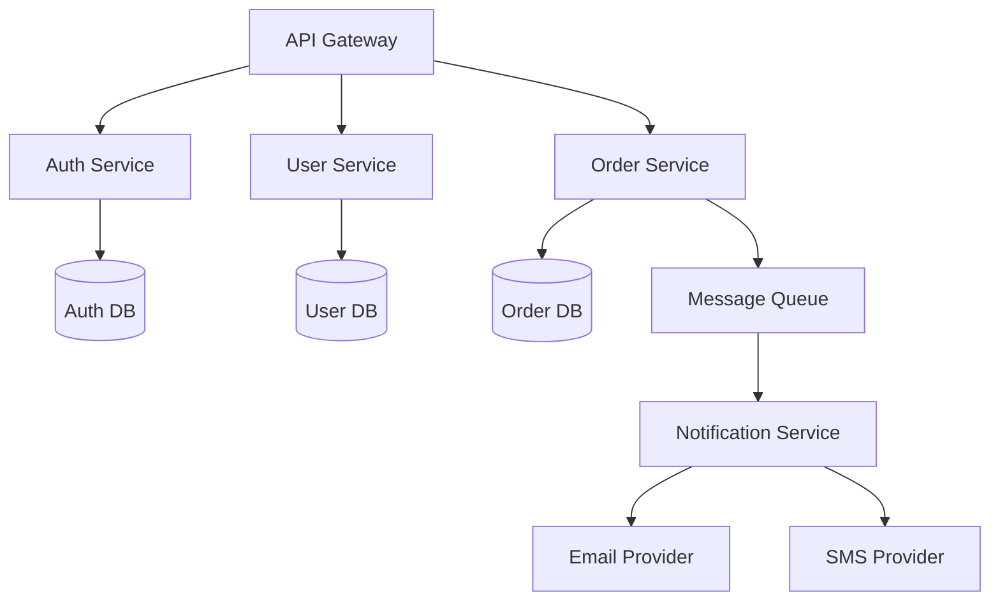

# Architecture Implementation Examples

## Table of Contents
1. [System Architecture Examples](#1-system-architecture-examples)
2. [Component Architecture Examples](#2-component-architecture-examples)
3. [Integration Architecture Examples](#3-integration-architecture-examples)
4. [Data Architecture Examples](#4-data-architecture-examples)
5. [Security Architecture Examples](#5-security-architecture-examples)
6. [Deployment Architecture Examples](#6-deployment-architecture-examples)

## 1. System Architecture Examples

### 1.1 Microservices Architecture



### 1.2 Event-Driven Architecture

```typescript
// Event definitions
interface OrderCreatedEvent {
  type: 'ORDER_CREATED';
  payload: {
    orderId: string;
    userId: string;
    items: OrderItem[];
    total: number;
  };
}

// Event handler
@Injectable()
export class OrderEventHandler {
  @OnEvent('ORDER_CREATED')
  async handleOrderCreated(event: OrderCreatedEvent) {
    // Process order
    await this.processOrder(event.payload);
    
    // Notify user
    await this.notificationService.notify({
      userId: event.payload.userId,
      type: 'ORDER_CONFIRMATION',
      data: {
        orderId: event.payload.orderId,
        total: event.payload.total
      }
    });
    
    // Update inventory
    await this.inventoryService.updateStock(
      event.payload.items
    );
  }
}
```

## 2. Component Architecture Examples

### 2.1 Core Component Structure

```typescript
// Core module configuration
@Module({
  imports: [
    ConfigModule.forRoot(),
    TypeOrmModule.forRootAsync({
      imports: [ConfigModule],
      useFactory: (config: ConfigService) => ({
        type: 'postgres',
        host: config.get('DB_HOST'),
        port: config.get('DB_PORT'),
        username: config.get('DB_USER'),
        password: config.get('DB_PASS'),
        database: config.get('DB_NAME'),
        entities: [__dirname + '/**/*.entity{.ts,.js}'],
        synchronize: false,
      }),
      inject: [ConfigService],
    }),
    EventEmitterModule.forRoot(),
    CacheModule.registerAsync({
      imports: [ConfigModule],
      useFactory: (config: ConfigService) => ({
        store: redisStore,
        host: config.get('REDIS_HOST'),
        port: config.get('REDIS_PORT'),
        ttl: 3600,
      }),
      inject: [ConfigService],
    }),
  ],
  providers: [
    {
      provide: APP_INTERCEPTOR,
      useClass: CacheInterceptor,
    },
    {
      provide: APP_FILTER,
      useClass: GlobalExceptionFilter,
    },
  ],
})
export class CoreModule {}
```

### 2.2 Feature Module Structure

```typescript
@Module({
  imports: [
    TypeOrmModule.forFeature([User, Profile]),
    CacheModule.register(),
    EventEmitterModule.forRoot(),
  ],
  controllers: [UserController],
  providers: [
    UserService,
    UserRepository,
    ProfileService,
    {
      provide: APP_GUARD,
      useClass: RolesGuard,
    },
  ],
  exports: [UserService],
})
export class UserModule {}
```

## 3. Integration Architecture Examples

### 3.1 API Gateway Configuration

```typescript
// API Gateway configuration
@Module({
  imports: [
    ConfigModule.forRoot(),
    ClientsModule.register([
      {
        name: 'AUTH_SERVICE',
        transport: Transport.TCP,
        options: {
          host: 'localhost',
          port: 3001,
        },
      },
      {
        name: 'USER_SERVICE',
        transport: Transport.TCP,
        options: {
          host: 'localhost',
          port: 3002,
        },
      },
    ]),
  ],
  controllers: [ApiGatewayController],
  providers: [
    {
      provide: APP_GUARD,
      useClass: AuthGuard,
    },
    {
      provide: APP_FILTER,
      useClass: HttpExceptionFilter,
    },
  ],
})
export class ApiGatewayModule {}
```

### 3.2 Message Queue Integration

```typescript
// Message queue configuration
@Module({
  imports: [
    ClientsModule.register([
      {
        name: 'NOTIFICATION_SERVICE',
        transport: Transport.RMQ,
        options: {
          urls: ['amqp://localhost:5672'],
          queue: 'notifications_queue',
          queueOptions: {
            durable: true,
          },
        },
      },
    ]),
  ],
  providers: [NotificationService],
})
export class NotificationModule {}
```

## 4. Data Architecture Examples

### 4.1 Database Schema

```typescript
// User entity
@Entity()
export class User {
  @PrimaryGeneratedColumn('uuid')
  id: string;

  @Column({ unique: true })
  email: string;

  @Column()
  @Exclude()
  password: string;

  @OneToOne(() => Profile)
  @JoinColumn()
  profile: Profile;

  @ManyToMany(() => Role)
  @JoinTable()
  roles: Role[];

  @CreateDateColumn()
  createdAt: Date;

  @UpdateDateColumn()
  updatedAt: Date;
}

// Profile entity
@Entity()
export class Profile {
  @PrimaryGeneratedColumn('uuid')
  id: string;

  @Column()
  firstName: string;

  @Column()
  lastName: string;

  @Column({ nullable: true })
  avatar: string;

  @OneToOne(() => User, user => user.profile)
  user: User;
}
```

### 4.2 Cache Strategy

```typescript
@Injectable()
export class CacheService {
  constructor(
    private readonly redis: Redis,
    private readonly config: ConfigService
  ) {}

  private getCacheKey(prefix: string, id: string): string {
    return `${prefix}:${id}`;
  }

  async cacheUser(user: User): Promise<void> {
    const key = this.getCacheKey('user', user.id);
    await this.redis.set(
      key,
      JSON.stringify(user),
      'EX',
      3600
    );
  }

  async getCachedUser(id: string): Promise<User | null> {
    const key = this.getCacheKey('user', id);
    const cached = await this.redis.get(key);
    return cached ? JSON.parse(cached) : null;
  }

  async invalidateUser(id: string): Promise<void> {
    const key = this.getCacheKey('user', id);
    await this.redis.del(key);
  }
}
```

## 5. Security Architecture Examples

### 5.1 Authentication Architecture

```typescript
@Injectable()
export class AuthService {
  constructor(
    private readonly userService: UserService,
    private readonly jwtService: JwtService,
    private readonly configService: ConfigService
  ) {}

  async validateUser(
    email: string,
    password: string
  ): Promise<any> {
    const user = await this.userService.findByEmail(email);
    if (user && await bcrypt.compare(password, user.password)) {
      const { password, ...result } = user;
      return result;
    }
    return null;
  }

  async login(user: any) {
    const payload = { email: user.email, sub: user.id };
    return {
      access_token: this.jwtService.sign(payload),
      refresh_token: this.jwtService.sign(payload, {
        expiresIn: '7d'
      })
    };
  }

  async refreshToken(token: string) {
    try {
      const payload = this.jwtService.verify(token);
      const user = await this.userService.findById(payload.sub);
      return this.login(user);
    } catch {
      throw new UnauthorizedException();
    }
  }
}
```

### 5.2 Authorization Architecture

```typescript
@Injectable()
export class RolesGuard implements CanActivate {
  constructor(
    private readonly reflector: Reflector,
    private readonly userService: UserService
  ) {}

  async canActivate(context: ExecutionContext): Promise<boolean> {
    const roles = this.reflector.get<string[]>(
      'roles',
      context.getHandler()
    );
    
    if (!roles) {
      return true;
    }

    const request = context.switchToHttp().getRequest();
    const user = request.user;

    const userRoles = await this.userService.getUserRoles(user.id);
    return roles.some(role => userRoles.includes(role));
  }
}
```

## 6. Deployment Architecture Examples

### 6.1 Docker Configuration

```dockerfile
# Dockerfile
FROM node:18-alpine AS builder

WORKDIR /app
COPY package*.json ./
RUN npm ci
COPY . .
RUN npm run build

FROM node:18-alpine

WORKDIR /app
COPY --from=builder /app/dist ./dist
COPY --from=builder /app/node_modules ./node_modules
COPY package*.json ./

EXPOSE 3000
CMD ["npm", "run", "start:prod"]
```

### 6.2 Kubernetes Configuration

```yaml
# deployment.yaml
apiVersion: apps/v1
kind: Deployment
metadata:
  name: api-deployment
spec:
  replicas: 3
  selector:
    matchLabels:
      app: api
  template:
    metadata:
      labels:
        app: api
    spec:
      containers:
      - name: api
        image: api:latest
        ports:
        - containerPort: 3000
        env:
        - name: NODE_ENV
          value: production
        - name: DB_HOST
          valueFrom:
            configMapKeyRef:
              name: api-config
              key: db_host
        resources:
          limits:
            cpu: "1"
            memory: "1Gi"
          requests:
            cpu: "500m"
            memory: "512Mi"
        livenessProbe:
          httpGet:
            path: /health
            port: 3000
          initialDelaySeconds: 30
          periodSeconds: 10
        readinessProbe:
          httpGet:
            path: /ready
            port: 3000
          initialDelaySeconds: 5
          periodSeconds: 5

---
# service.yaml
apiVersion: v1
kind: Service
metadata:
  name: api-service
spec:
  selector:
    app: api
  ports:
  - port: 80
    targetPort: 3000
  type: LoadBalancer