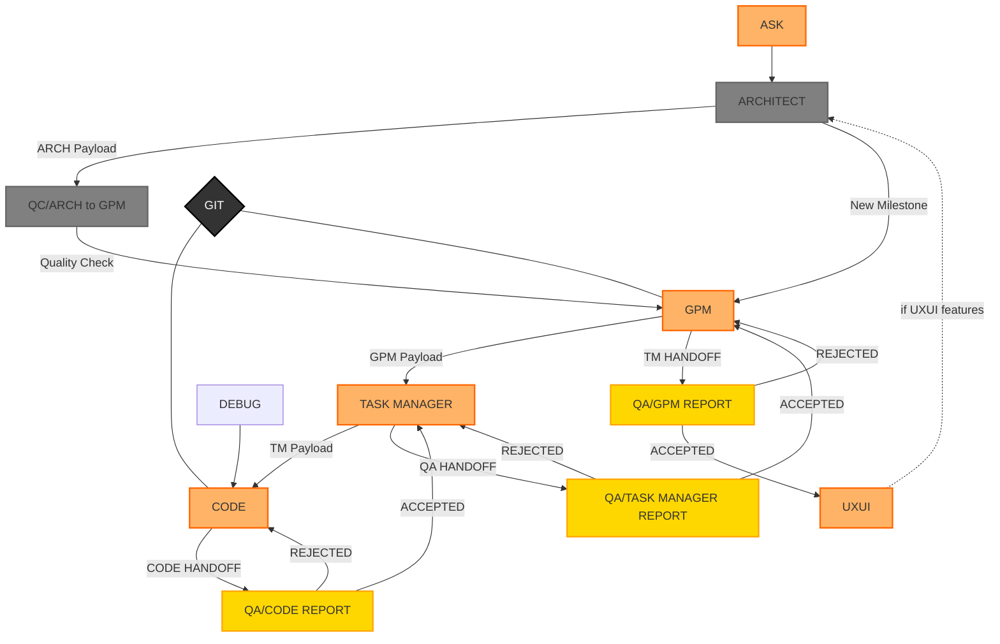

# Combined Workflow (Downstream & Upstream)

## 1. Complete Flow Diagram

## 2. Flow Description

### 2.1 Downstream Flow (Requirements & Implementation)
1. Initial Input
   - ASK → ARCHITECT (requirements)
   - UXUI → ARCHITECT (design specs, if needed)

2. Architecture Phase
   - ARCHITECT → QC (for verification)
   - ARCHITECT → GPM (new milestones)

3. Planning Phase
   - GPM → TASK MANAGER (project planning)
   - TASK MANAGER → CODE (implementation tasks)

### 2.2 Upstream Flow (Reports & Feedback)
1. Implementation Level
   - CODE → QA/CODE REPORT
   - QA/CODE REPORT → TASK MANAGER (if accepted)
   - QA/CODE REPORT → CODE (if rejected)

2. Task Management Level
   - TASK MANAGER → QA/TASK MANAGER REPORT
   - QA/TASK MANAGER REPORT → GPM (if accepted)
   - QA/TASK MANAGER REPORT → TASK MANAGER (if rejected)

3. Project Management Level
   - GPM → QA/GPM REPORT
   - QA/GPM REPORT → UXUI (if accepted)
   - QA/GPM REPORT → GPM (if rejected)

## 3. Quality Gates

### 3.1 Architecture Gate
- QC/ARCH to GPM checkpoint
- Verifies architecture decisions
- Ensures standards compliance
- Controls flow to GPM

### 3.2 Implementation Gates
1. QA/CODE REPORT
   - Implementation quality
   - Test coverage
   - Documentation
   - Standards compliance

2. QA/TASK MANAGER REPORT
   - Task completion
   - Resource utilization
   - Timeline adherence
   - Quality metrics

3. QA/GPM REPORT
   - Milestone achievement
   - Project progress
   - Resource management
   - Overall quality

## 4. Support Systems

### 4.1 Version Control
- GIT connected to CODE and GPM
- Maintains code history
- Tracks changes
- Ensures version control

### 4.2 Debug Support
- DEBUG connected to CODE
- Provides error resolution
- Supports implementation
- Maintains code quality

## 5. Payloads

### 5.1 Downstream Payloads
1. ARCH Payload
   - Technical specifications
   - Architecture decisions
   - System design
   - Integration requirements

2. GPM Payload
   - Project milestones
   - Resource allocations
   - Timeline planning
   - Dependency mapping

3. TM Payload
   - Task breakdowns
   - Implementation priorities
   - Resource assignments
   - Delivery schedules

### 5.2 Upstream Reports
1. QA/CODE Report
   - Implementation status
   - Test results
   - Coverage metrics
   - Quality measurements

2. QA/TASK MANAGER Report
   - Task completion status
   - Resource utilization
   - Timeline adherence
   - Quality metrics

3. QA/GPM Report
   - Milestone status
   - Project progress
   - Resource efficiency
   - Quality achievements

This combined workflow ensures:
1. Clear bidirectional communication
2. Quality control at all levels
3. Proper feedback loops
4. Continuous improvement
5. Effective project management