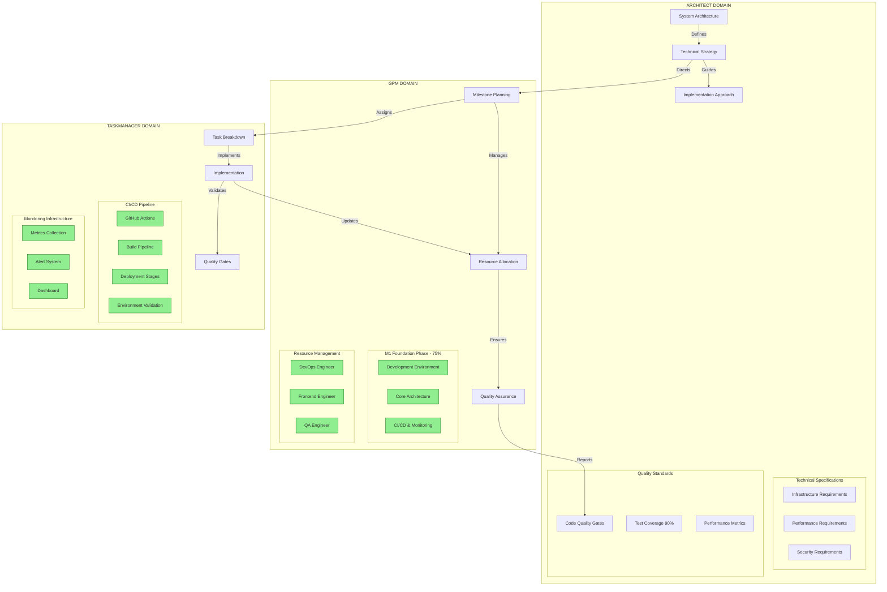
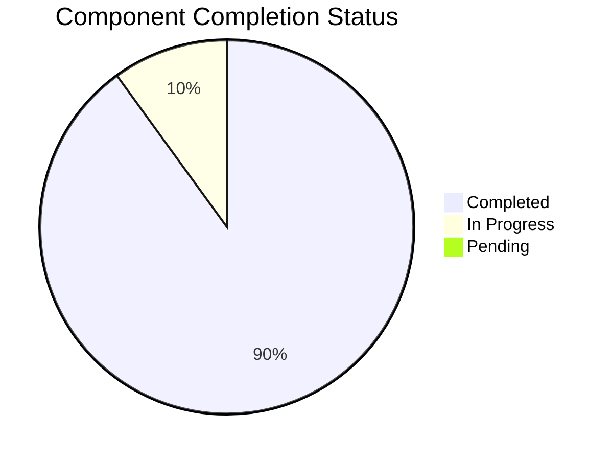
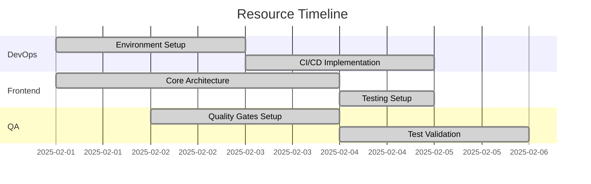
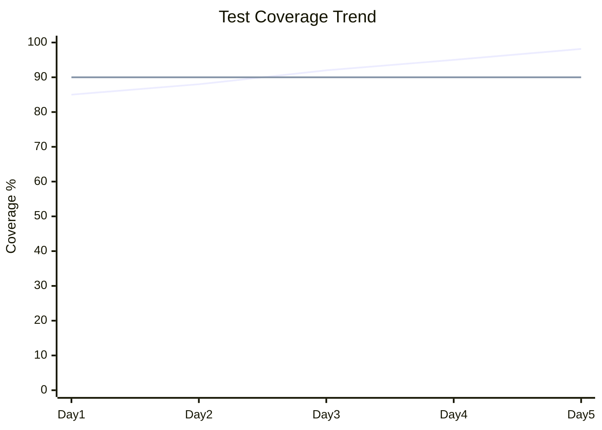
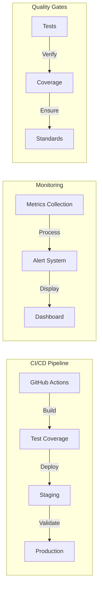

Roo: GPM
PROJECT: mExpress
DOCUMENT: Project Visualization
MILESTONE: M1 - Foundation Phase

## Project Structure

## Implementation Progress

## Resource Utilization

## Quality Metrics

## System Architecture

Legend:
* Green boxes indicate completed components
* Red boxes indicate in-progress components
* Gray boxes indicate pending components