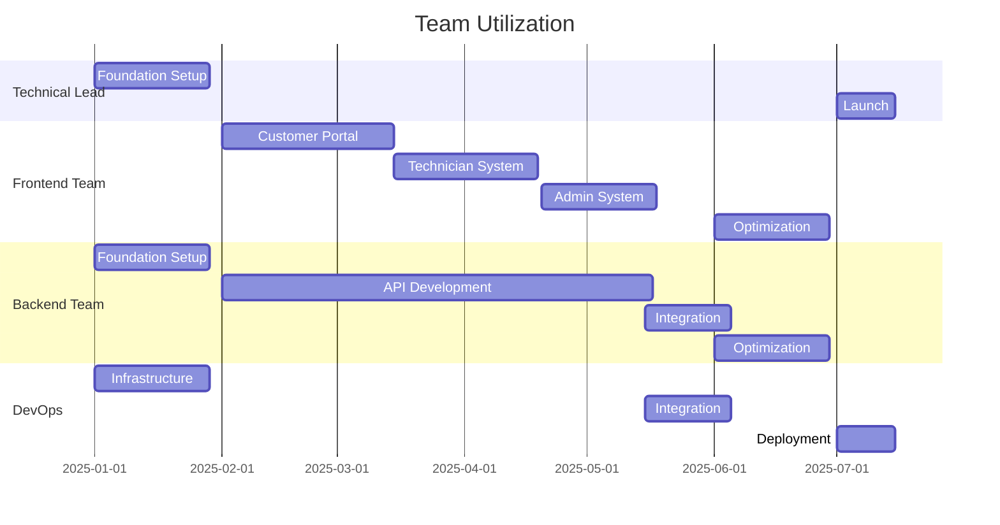

# mExpress Resource Allocation Plan

## 1. Team Structure

### 1.1 Core Development Team

| Role                | Count | Primary Responsibilities                    | Allocation |
| ------------------- | ----- | ------------------------------------------- | ---------- |
| Technical Lead      | 1     | Architecture oversight, technical decisions | 100%       |
| Frontend Developers | 4     | UI implementation, client-side logic        | 100%       |
| Backend Developers  | 4     | API development, service implementation     | 100%       |
| DevOps Engineers    | 2     | Infrastructure, CI/CD, monitoring           | 100%       |
| QA Engineers        | 2     | Testing, quality assurance                  | 100%       |
| Security Specialist | 1     | Security implementation, auditing           | 50%        |

### 1.2 Support Team

| Role             | Count | Primary Responsibilities                  | Allocation |
| ---------------- | ----- | ----------------------------------------- | ---------- |
| Project Manager  | 1     | Project oversight, coordination           | 100%       |
| Business Analyst | 1     | Requirements clarification, documentation | 50%        |
| UX Designer      | 1     | Design implementation support             | 25%        |

## 2. Milestone Resource Allocation

### 2.1 Foundation Setup (Weeks 1-4)

| Resource            | Allocation | Focus Areas                                |
| ------------------- | ---------- | ------------------------------------------ |
| Technical Lead      | 100%       | Architecture implementation, team guidance |
| Backend Developers  | 100%       | Core services, database setup              |
| DevOps Engineers    | 100%       | Infrastructure setup, CI/CD                |
| Security Specialist | 50%        | Security framework implementation          |

### 2.2 Customer Portal Implementation (Weeks 5-10)

| Resource            | Allocation | Focus Areas                          |
| ------------------- | ---------- | ------------------------------------ |
| Frontend Developers | 100%       | Portal UI, client-side features      |
| Backend Developers  | 75%        | API development, service integration |
| QA Engineers        | 50%        | Testing, quality assurance           |
| UX Designer         | 25%        | Implementation support               |

### 2.3 Technician System Implementation (Weeks 11-15)

| Resource            | Allocation | Focus Areas                         |
| ------------------- | ---------- | ----------------------------------- |
| Frontend Developers | 100%       | Technician interface, workflows     |
| Backend Developers  | 75%        | Service implementation, integration |
| QA Engineers        | 50%        | Testing, workflow validation        |
| UX Designer         | 25%        | Implementation support              |

### 2.4 Admin System Implementation (Weeks 16-19)

| Resource            | Allocation | Focus Areas                    |
| ------------------- | ---------- | ------------------------------ |
| Frontend Developers | 100%       | Admin interface, dashboards    |
| Backend Developers  | 75%        | Admin services, reporting      |
| QA Engineers        | 50%        | Testing, admin features        |
| Security Specialist | 50%        | Access control, security audit |

### 2.5 External Integration (Weeks 20-22)

| Resource            | Allocation | Focus Areas                |
| ------------------- | ---------- | -------------------------- |
| Backend Developers  | 100%       | Integration implementation |
| DevOps Engineers    | 50%        | Integration infrastructure |
| QA Engineers        | 100%       | Integration testing        |
| Security Specialist | 50%        | Security validation        |

### 2.6 Testing and Optimization (Weeks 23-26)

| Resource            | Allocation | Focus Areas                |
| ------------------- | ---------- | -------------------------- |
| QA Engineers        | 100%       | System testing, validation |
| Frontend Developers | 50%        | UI optimization            |
| Backend Developers  | 50%        | Service optimization       |
| DevOps Engineers    | 100%       | Performance optimization   |
| Security Specialist | 50%        | Security testing           |

### 2.7 Deployment and Launch (Weeks 27-28)

| Resource            | Allocation | Focus Areas           |
| ------------------- | ---------- | --------------------- |
| DevOps Engineers    | 100%       | Production deployment |
| Technical Lead      | 100%       | Launch oversight      |
| QA Engineers        | 100%       | Launch validation     |
| Security Specialist | 50%        | Final security audit  |

## 3. Resource Loading

### 3.1 Team Utilization

### 3.2 Critical Resource Dependencies

1. Technical Lead availability for architectural decisions
2. Security Specialist for security-critical features
3. DevOps Engineers for infrastructure setup
4. QA Engineers for testing phases

## 4. Resource Risk Management

### 4.1 Risk Factors

1. Resource availability during critical phases
2. Skill set requirements for integrations
3. Team coordination for parallel development
4. Knowledge transfer requirements

### 4.2 Mitigation Strategies

1. Cross-training team members
2. Documentation of critical procedures
3. Regular knowledge sharing sessions
4. Flexible resource allocation

## 5. Resource Onboarding

### 5.1 Onboarding Requirements

1. Development environment setup
2. Access to documentation
3. System architecture overview
4. Security protocols training

### 5.2 Knowledge Transfer

1. Technical documentation
2. Codebase walkthroughs
3. Integration specifications
4. Security requirements

## 6. Communication Plan

### 6.1 Team Communication

1. Daily standups
2. Weekly technical reviews
3. Bi-weekly planning sessions
4. Monthly progress reviews

### 6.2 Stakeholder Communication

1. Weekly status reports
2. Monthly milestone reviews
3. Quarterly business reviews
4. Ad-hoc issue resolution

## 7. Resource Quality Metrics

### 7.1 Performance Metrics

1. Code quality metrics
2. Test coverage
3. Bug resolution time
4. Documentation quality

### 7.2 Team Metrics

1. Sprint velocity
2. Milestone completion rate
3. Resource utilization
4. Knowledge sharing effectiveness

## 8. Continuous Improvement

### 8.1 Process Improvement

1. Regular retrospectives
2. Process optimization
3. Tool evaluation
4. Skill development

### 8.2 Resource Development

1. Technical training
2. Skill enhancement
3. Knowledge sharing
4. Career development

This resource allocation plan ensures efficient distribution and utilization of team resources across all project milestones.
