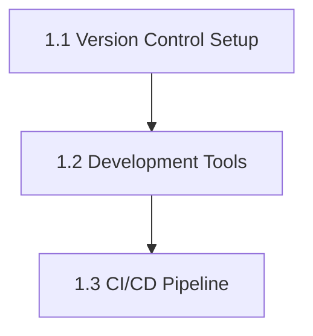
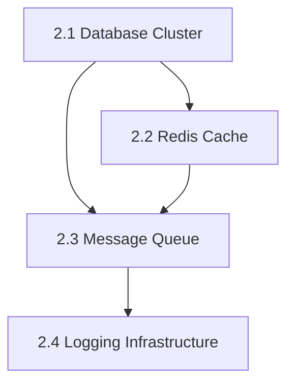
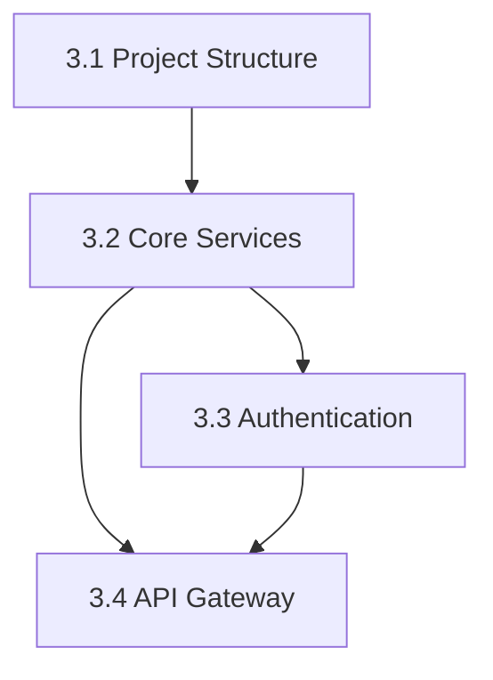

# Milestone 1: Foundation Setup - Dependency Map

## Critical Path Analysis

### Path 1: Development Environment Setup

**Critical Time:** 5 days
**Risk Level:** Medium
**Dependencies:**

- Version Control must be setup before tools configuration
- CI/CD requires both VCS and tools setup

### Path 2: Infrastructure Setup

**Critical Time:** 5 days
**Risk Level:** High
**Dependencies:**

- Database cluster required for cache setup
- Both DB and cache required for message queue
- Logging depends on queue system for log shipping

### Path 3: Architecture Implementation

**Critical Time:** 10 days
**Risk Level:** High
**Dependencies:**

- Project structure required for service implementation
- Core services needed for auth and gateway
- Authentication required for API gateway completion

## Cross-Path Dependencies

### Infrastructure Dependencies

1. Development Environment → Infrastructure

   - CI/CD pipeline needs infrastructure for deployment
   - Development tools require logging setup

2. Infrastructure → Architecture
   - Database required for services
   - Cache required for authentication
   - Message queue needed for gateway

### Security Dependencies

1. Version Control → Security

   - Access control configuration
   - Repository security setup

2. Infrastructure → Security

   - Database security configuration
   - Cache security setup
   - Queue security implementation

3. Architecture → Security
   - Authentication framework
   - API security implementation

## Resource Dependencies

### Technical Lead Dependencies

- Required for all architectural decisions
- Final approval on technical implementations
- Critical for project structure setup

### Backend Team Dependencies

- Database and cache setup expertise
- Service implementation knowledge
- Authentication system experience

### DevOps Team Dependencies

- Infrastructure setup capabilities
- CI/CD implementation expertise
- Monitoring system knowledge

### Security Specialist Dependencies

- Security framework implementation
- Security review availability
- Compliance verification expertise

## Timeline Dependencies

### Week 1 Dependencies

- Development environment setup must complete
- Security baseline must be established
- Team access must be configured

### Week 2 Dependencies

- Infrastructure components must be ready
- Monitoring must be operational
- Security controls must be in place

### Week 3-4 Dependencies

- Core services must be implemented
- Authentication must be functional
- API gateway must be operational

## Risk-Based Dependencies

### High-Risk Dependencies

1. Database Cluster Setup

   - Critical for all subsequent tasks
   - Required for development progress
   - Essential for testing

2. Authentication System

   - Required for secure development
   - Needed for API gateway
   - Essential for testing

3. Core Services Framework
   - Foundation for all services
   - Required for feature development
   - Critical for integration

### Mitigation Strategies

#### Technical Dependencies

1. Early Architecture Review

   - Pre-implementation validation
   - Design pattern confirmation
   - Technology stack verification

2. Proof of Concept Testing

   - Critical component validation
   - Integration testing
   - Performance verification

3. Fallback Plans
   - Alternative solutions identified
   - Temporary workarounds ready
   - Recovery procedures documented

#### Resource Dependencies

1. Knowledge Sharing

   - Cross-training sessions
   - Documentation requirements
   - Pair programming

2. Backup Resources

   - Secondary assignments defined
   - Skill matrix maintained
   - Coverage plan documented

3. External Support
   - Vendor support agreements
   - Expert consultation available
   - Emergency response plan

## Quality Gate Dependencies

### Entry Criteria Dependencies

1. Development Environment

   - Tool selection complete
   - Security baseline established
   - Access controls configured

2. Infrastructure Setup

   - Architecture approved
   - Security requirements defined
   - Performance criteria established

3. Service Implementation
   - API specifications complete
   - Security model approved
   - Testing strategy defined

### Exit Criteria Dependencies

1. Development Environment

   - All tools operational
   - CI/CD pipeline verified
   - Security controls validated

2. Infrastructure Setup

   - All components tested
   - Performance verified
   - Security validated

3. Service Implementation
   - All services tested
   - Security audit passed
   - Documentation complete

## Success Criteria Dependencies

1. Quality Requirements

   - All tests passing
   - Security verification complete
   - Performance targets met

2. Documentation Requirements

   - Technical documentation complete
   - Operational guides available
   - Security documentation verified

3. Process Requirements
   - All reviews completed
   - Approvals obtained
   - Handoff criteria met
