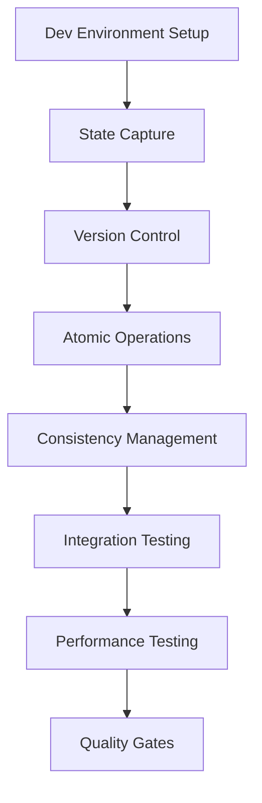

# Milestone 1.1: State Management System Dependency Map

## Component Dependencies

### 1. State Capture System
**Dependencies**:
- Development environment setup
- Event system framework
- Monitoring infrastructure
- Storage system access

**Dependent Components**:
- Version Control Integration
- Atomic Operations Handler
- State Consistency Management

### 2. Version Control Integration
**Dependencies**:
- State Capture System
- VCS infrastructure
- Hook mechanism
- Storage access

**Dependent Components**:
- Atomic Operations Handler
- State Consistency Management

### 3. Atomic Operations Handler
**Dependencies**:
- State Capture System
- Version Control Integration
- Transaction framework
- Error handling system

**Dependent Components**:
- State Consistency Management

### 4. State Consistency Management
**Dependencies**:
- State Capture System
- Version Control Integration
- Atomic Operations Handler
- Validation framework

## Task Dependencies

### Critical Path
1. Development Environment Setup
2. State Capture Implementation
3. Version Control Integration
4. Atomic Operations Implementation
5. Consistency Management Implementation
6. Integration Testing
7. Performance Validation
8. Quality Gate Verification

### Dependency Chain

## Infrastructure Dependencies

### Development Environment
**Required Components**:
- Application servers
- Test servers
- Storage systems
- Network configuration
- Monitoring setup

**Dependencies**:
- Hardware allocation
- Network setup
- Tool installation
- Access configuration

### Test Environment
**Required Components**:
- Integration test servers
- Performance test servers
- Test data storage
- Monitoring tools

**Dependencies**:
- Environment setup
- Test framework
- Data preparation
- Tool configuration

## External Dependencies

### Version Control System
**Required Features**:
- Hook support
- API access
- State storage
- History tracking

**Integration Points**:
- Pre-commit hooks
- Post-commit hooks
- State tracking
- Version management

### Monitoring System
**Required Features**:
- Metric collection
- Performance monitoring
- Alert management
- Dashboard creation

**Integration Points**:
- Metric endpoints
- Alert configuration
- Dashboard setup
- Log aggregation

## Resource Dependencies

### Team Dependencies
1. Senior Backend Developer
   - Primary for implementation
   - Requires DevOps support
   - Needs QA validation

2. DevOps Engineer
   - Environment setup
   - Infrastructure support
   - Monitoring integration

3. QA Engineer
   - Test planning
   - Quality validation
   - Performance testing

## Timeline Dependencies

### Week 1
**Days 1-2**:
- Environment setup (Blocking)
- Framework setup (Blocking)
- Initial implementation

**Days 3-5**:
- State capture implementation
- Version control integration
- Initial testing

### Week 2
**Days 1-3**:
- Atomic operations implementation
- Integration work
- Performance testing

**Days 4-5**:
- Consistency management
- Final testing
- Documentation

## Quality Gate Dependencies

### Entry Gate
**Required Items**:
- Architecture approval
- Environment readiness
- Test plan approval
- Resource confirmation

### Exit Gate
**Required Items**:
- Performance validation
- Test coverage verification
- Documentation completion
- Integration validation

## Risk Dependencies

### Technical Risks
1. Performance Impact
   - Depends on: State capture efficiency
   - Affects: System operations
   - Mitigation: Early testing

2. Integration Issues
   - Depends on: Component interfaces
   - Affects: System stability
   - Mitigation: Interface validation

### Resource Risks
1. Team Availability
   - Depends on: Resource allocation
   - Affects: Timeline
   - Mitigation: Backup resources

2. Infrastructure Availability
   - Depends on: Environment setup
   - Affects: Development progress
   - Mitigation: Redundancy planning

## Documentation Dependencies

### Technical Documentation
**Required Before**:
- Implementation start
- Integration work
- Testing phase

**Required After**:
- Implementation completion
- Testing completion
- Quality validation

### Operational Documentation
**Required Before**:
- Environment setup
- Testing start
- Integration work

**Required After**:
- Implementation completion
- Testing completion
- Deployment preparation

## Success Criteria Dependencies

### Performance Requirements
- State capture < 5 minutes
  - Depends on: Implementation efficiency
  - Affects: Overall system performance

### Quality Requirements
- Test coverage > 80%
  - Depends on: Test implementation
  - Affects: Quality validation

### Integration Requirements
- All components integrated
  - Depends on: Component completion
  - Affects: System functionality