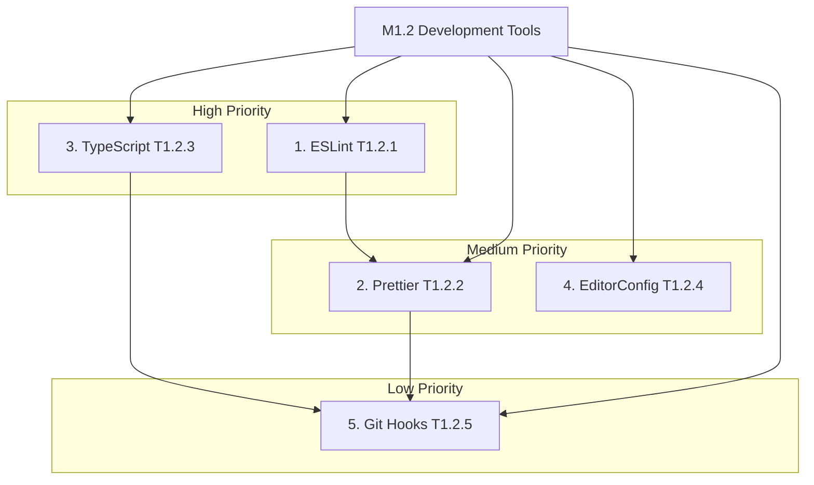
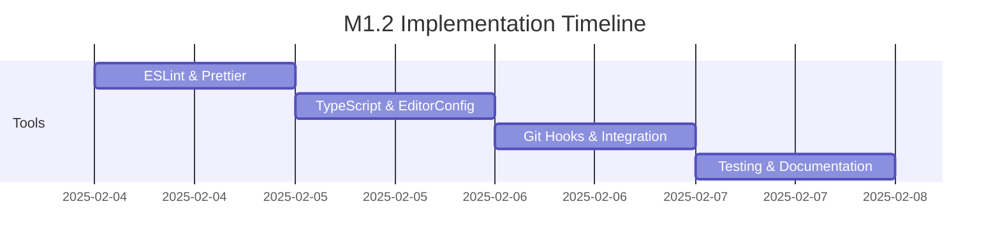

# Milestone 1.2: Development Tools Configuration

## Task Overview
Configure and integrate essential development tools for code quality and consistency.

## Task Hierarchy

### 1. ESLint Configuration (T1.2.1)
- Install ESLint dependencies
- Configure ESLint with security rules
- Create base configuration file
- Test rule enforcement
- Document configuration

### 2. Prettier Setup (T1.2.2)
- Install Prettier
- Configure formatting rules
- Create configuration file
- Test formatting
- Document setup

### 3. TypeScript Configuration (T1.2.3)
- Configure compiler options
- Enable strict mode
- Set up build pipeline
- Test compilation
- Document configuration

### 4. Editor Config Setup (T1.2.4)
- Create EditorConfig file
- Configure style rules
- Test configuration
- Document settings

### 5. Git Hooks Integration (T1.2.5)
- Install husky
- Configure pre-commit hooks
- Link with ESLint and Prettier
- Test hook execution
- Document integration

## Timeline View

## Priority Levels
1. High: ESLint, TypeScript Configuration
2. Medium: Prettier, Editor Config
3. Low: Git Hooks Integration

## Effort Estimates
- T1.2.1: 4 hours
- T1.2.2: 3 hours
- T1.2.3: 4 hours
- T1.2.4: 2 hours
- T1.2.5: 3 hours

## Technical Requirements
### ESLint
- Security rules enabled
- Code style enforcement
- Integration with IDE

### Prettier
- Team standard formatting
- IDE integration
- Automatic formatting

### TypeScript
- Strict mode enabled
- Optimized compilation
- Clear error reporting

### Editor Config
- Consistent style rules
- Cross-editor support
- Team standards alignment

### Git Hooks
- Pre-commit validation
- Tool integration
- Error prevention

## Acceptance Criteria
1. All tools successfully installed and configured
2. Configuration files properly documented
3. Integration tests passing
4. IDE integration verified
5. Git hooks functioning
6. Documentation complete
7. 85% test coverage achieved

## Progress Tracking
- Task status updates
- Daily progress reports
- Blocker documentation
- Quality metrics tracking