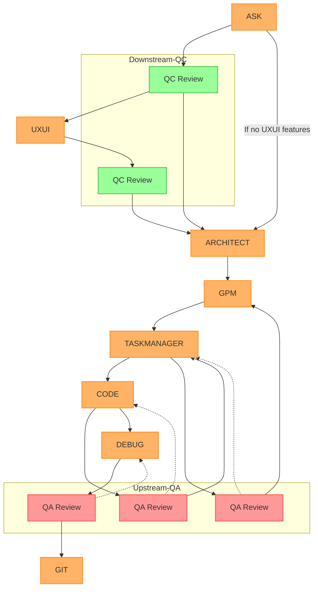

# Quality Control Streams Diagram

## Stream Descriptions

### Downstream QC (Quality Control)
1. ASK initiates project
2. QC reviews initial requirements
3. Routes to UXUI if needed, or directly to ARCHITECT
4. UXUI work reviewed by QC
5. ARCHITECT receives validated design
6. Flows through GPM to TASKMANAGER to CODE

### Upstream QA (Quality Assurance)
1. CODE implementation reviewed by QA
2. Feedback loop through TASKMANAGER
3. Project impact assessed by GPM
4. DEBUG fixes reviewed by QA
5. Final validation before GIT

### Key Features
- Clear separation of QC and QA concerns
- Distinct feedback loops
- Conditional routing based on UXUI needs
- Multiple validation points
- Comprehensive quality coverage