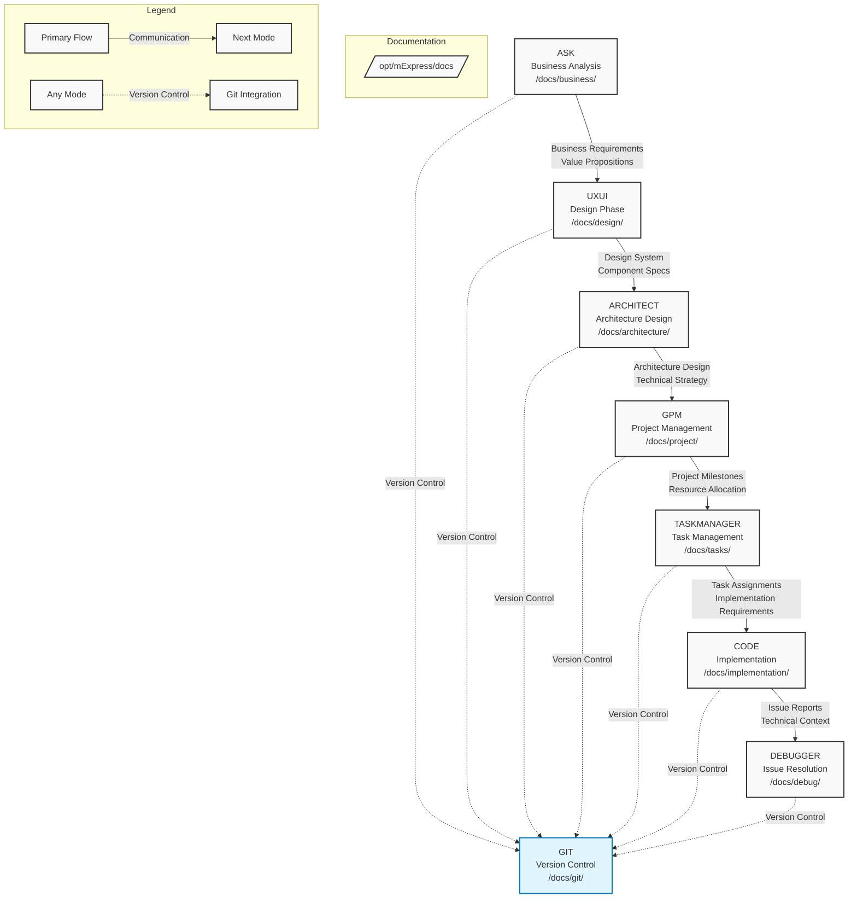

# RooCode Mode Chain and Communication Flow

## Mode Chain Sequence
1. **ASK** (Business Analysis)
   - Receives business requirements
   - Defines value propositions
   - Documents in /docs/business/

2. **UXUI** (Design Phase)
   - Creates design system
   - Defines component specifications
   - Documents in /docs/design/

3. **ARCHITECT** (Architecture Design)
   - Develops technical strategy
   - Creates architecture design
   - Documents in /docs/architecture/

4. **GPM** (Project Management)
   - Plans project milestones
   - Allocates resources
   - Documents in /docs/project/

5. **TASKMANAGER** (Task Management)
   - Breaks down milestones
   - Assigns tasks
   - Documents in /docs/tasks/

6. **CODE** (Implementation)
   - Implements features
   - Writes tests
   - Documents in /docs/implementation/

7. **DEBUGGER** (Issue Resolution)
   - Resolves issues
   - Validates fixes
   - Documents in /docs/debug/

8. **GIT** (Version Control)
   - Manages versions
   - Tracks changes
   - Documents in /docs/git/

## Communication Paths
- **Primary Flow**: Sequential communication through the mode chain
- **Version Control**: All modes communicate with GIT for change management
- **Documentation**: All modes read from and write to their specific directories

## Quality Gates
Each transition requires:
- Documentation completeness
- Quality validation
- State preservation
- Test coverage
- Security compliance